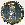
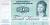

---
# Non-[US|India] Coins
linktitle: Non-[US|India] Coins
summary: Non-[US|India] Coins
weight: 20

title: Non-[US|India] Coins
date: "2019-12-05T00:00:00Z"
lastmod: "2019-12-05T00:00:00Z"
draft: false

toc: true
type: docs
editable: false

menu:
    numismatics:
        name: Non-[US|India] Coins
        weight: 81
---

Generally hopelessly outdated

Separate pages exist for US
(<A HREF="usseries.html">yearly series</A> and <A HREF="usquarters.html">
quarters</A>), <A HREF="indian.html">Indian</A> and <A HREF="euro4.html">
Euro</A> collections.  
<TABLE>

<a href="#A">A</a> |
<a href="#B">B</a> |
<a href="#C">C</a> |
<a href="#D">D</a> |
<a href="#E">E</a> |
<a href="#F">F</a> |
<a href="#G">G</a> |
<a href="#F">H</a> |
<a href="#I">I</a> |
<a href="#J">J</a> |
<a href="#K">K</a> |
<a href="#L">L</a> |
<a href="#M">M</a> |
<a href="#N">N</a> |
<a href="#O">O</a> |
<a href="#P">P</a> |
<a href="#Q">Q</a> |
<a href="#R">R</a> |
<a href="#S">S</a> |
<a href="#T">T</a> |
<a href="#U">U</a> |
<a href="#V">V</a> |
<a href="#W">W</a> |
<a href="#X">X</a> |
<a href="#Y">Y</a> |
<a href="#Z">Z</a>

<TR BGCOLOR="#666600"><TD WIDTH=20%>Country</TD><TD>Type</TD><TD>Year</TD><TD>Denomination</TD><TD>KM</TD></TR>
<TR><TD> <a name="3"><b>3</b></a> 
<a href="../mycoins"></img></a> </TD></TR>
<TR BGCOLOR="#666600"><TD WIDTH=20%>Country</TD><TD>Type</TD><TD>Year</TD><TD>Denomination</TD><TD>KM</TD></TR>
<TR><TD BGCOLOR="#FFDEAD" WIDTH=20%>3rd Republic of Czechoslovakia</TD><TD></TD><TD> 1947</TD><TD> 2 Koruny</TD><TD> km 23</TD></TR>
<TR><TD WIDTH=20%>3rd Republic of Czechoslovakia</TD><TD></TD><TD> 1947</TD><TD> 50 Haleru</TD><TD> km 21</TD></TR>
<TR><TD> <a name="A"><b>A</b></a> 
<a href="../mycoins"></img></a> </TD></TR>
<TR BGCOLOR="#666600"><TD WIDTH=20%>Country</TD><TD>Type</TD><TD>Year</TD><TD>Denomination</TD><TD>KM</TD></TR>
<TR><TD BGCOLOR="#FFDEAD" WIDTH=20%>Afghanistan</TD><TD></TD><TD>1960</TD><TD>5 Afghanis</TD><TD></TD></TR>
<TR><TD WIDTH=20%>Afghanistan</TD><TD></TD><TD></TD><TD>20 Afghanis</TD><TD></TD></TR>
<TR><TD BGCOLOR="#FFDEAD" WIDTH=20%>Argentina</TD><TD></TD><TD>1995</TD><TD>1 peso</TD><TD>?</TD></TR>
<TR><TD WIDTH=20%>Argentina</TD><TD></TD><TD>1975</TD><TD>1 peso</TD><TD>44</TD></TR>
<TR><TD WIDTH=20%>Argentina</TD><TD></TD><TD>1993</TD><TD>10 cent</TD><TD>82</TD></TR>
<TR><TD WIDTH=20%>Argentina</TD><TD></TD><TD>1993</TD><TD>25 cent</TD><TD></TD></TR>
<TR><TD WIDTH=20%>Argentina</TD><TD></TD><TD>1993</TD><TD>50 cents</TD><TD></TD></TR>
<TR><TD WIDTH=20%>Argentina</TD><TD></TD><TD>1992</TD><TD>10 Centavos</TD><TD></TD></TR>
<TR><TD WIDTH=20%>Argentina</TD><TD></TD><TD>1992</TD><TD>25 Centavos</TD><TD></TD></TR>
<TR><TD WIDTH=20%>Argentina</TD><TD></TD><TD>1994</TD><TD>25 Centavos</TD><TD></TD></TR>
<TR><TD BGCOLOR="#FFDEAD" WIDTH=20%>Armenia</TD><TD></TD><TD>1994</TD><TD>1 Dram</TD><TD></TD></TR>
<TR><TD WIDTH=20%>Armenia</TD><TD></TD><TD>1994</TD><TD>3 Dram</TD><TD></TD></TR>
<TR><TD WIDTH=20%>Armenia</TD><TD></TD><TD>1994</TD><TD>5 Dram</TD><TD></TD></TR>
<TR><TD WIDTH=20%>Armenia</TD><TD></TD><TD>1994</TD><TD>10 Luma</TD><TD></TD></TR>
<TR><TD WIDTH=20%>Armenia</TD><TD></TD><TD>1994</TD><TD>20 Luma</TD><TD></TD></TR>
<TR><TD WIDTH=20%>Armenia</TD><TD></TD><TD>1994</TD><TD>50 Luma</TD><TD></TD></TR>
<TR><TD BGCOLOR="#FFDEAD" WIDTH=20%>Australia</TD><TD></TD><TD>1980</TD><TD>5 cents</TD><TD></TD></TR>
<TR><TD WIDTH=20%>Australia</TD><TD></TD><TD>1987</TD><TD>5 cents</TD><TD>80</TD></TR>
<TR><TD WIDTH=20%>Australia</TD><TD></TD><TD>1981</TD><TD>5 cents</TD><TD>km64</TD></TR>
<TR><TD WIDTH=20%>Australia</TD><TD></TD><TD>1984</TD><TD>1 Dollar</TD><TD></TD></TR>
<TR><TD WIDTH=20%>Australia</TD><TD></TD><TD>1994</TD><TD>1 Dollar</TD><TD>84</TD></TR>
<TR><TD WIDTH=20%>Australia</TD><TD></TD><TD>2001</TD><TD>1 dollar</TD><TD></TD></TR>
<TR><TD WIDTH=20%>Australia</TD><TD></TD><TD>1969</TD><TD>10 cents</TD><TD></TD></TR>
<TR><TD WIDTH=20%>Australia</TD><TD></TD><TD>1978</TD><TD>10 cents</TD><TD>65</TD></TR>
<TR><TD WIDTH=20%>Australia</TD><TD></TD><TD>1998</TD><TD>10 cents</TD><TD>81</TD></TR>
<TR><TD WIDTH=20%>Australia</TD><TD></TD><TD>2001</TD><TD>10 cents</TD><TD>~km81</TD></TR>
<TR><TD WIDTH=20%>Australia</TD><TD></TD><TD>1989</TD><TD>2 Dollar</TD><TD>101</TD></TR>
<TR><TD WIDTH=20%>Australia</TD><TD></TD><TD>1966</TD><TD>20 cents</TD><TD></TD></TR>
<TR><TD WIDTH=20%>Australia</TD><TD></TD><TD>1968</TD><TD>20 cents</TD><TD>66</TD></TR>
<TR><TD WIDTH=20%>Australia</TD><TD></TD><TD>1976</TD><TD>50 cents</TD><TD></TD></TR>
<TR><TD WIDTH=20%>Australia</TD><TD></TD><TD>1983</TD><TD>50 cents</TD><TD>68</TD></TR>
<TR><TD WIDTH=20%>Australia</TD><TD></TD><TD>1999</TD><TD>50 cents</TD><TD>km83?</TD></TR>
<TR><TD WIDTH=20%>Australia</TD><TD></TD><TD>1988</TD><TD>2 Dollars</TD><TD></TD></TR>
<TR><TD WIDTH=20%>Australia</TD><TD></TD><TD> 1952</TD><TD> 1 p</TD><TD> 43</TD></TR>
<TR><TD WIDTH=20%>Australia</TD><TD></TD><TD></TD><TD> 5 Dollars</TD><TD></TD></TR>
<TR><TD WIDTH=20%>Australia</TD><TD></TD><TD></TD><TD>5 Dollars</TD><TD></TD></TR>
<TR><TD WIDTH=20%>Australia</TD><TD></TD><TD></TD><TD>5 Dollars</TD><TD></TD></TR>
<TR><TD WIDTH=20%>Australia</TD><TD></TD><TD></TD><TD>5 Dollars</TD><TD></TD></TR>
<TR><TD WIDTH=20%>Australia</TD><TD></TD><TD></TD><TD> 10 Dollars</TD><TD></TD></TR>
<TR><TD WIDTH=20%>Australia</TD><TD></TD><TD></TD><TD>10 dollars</TD><TD></TD></TR>
<TR><TD BGCOLOR="#FFDEAD" WIDTH=20%>Austria</TD><TD></TD><TD>1966</TD><TD>2 Groschen</TD><TD>2876</TD></TR>
<TR><TD WIDTH=20%>Austria</TD><TD></TD><TD>1979</TD><TD>5 Schiling</TD><TD>2889a</TD></TR>
<TR><TD WIDTH=20%>Austria</TD><TD></TD><TD>1974</TD><TD>1 schilling</TD><TD></TD></TR>
<TR><TD WIDTH=20%>Austria</TD><TD></TD><TD>km2878</TD><TD>10 Groschen</TD><TD>1992</TD></TR>
<TR><TD WIDTH=20%>Austria</TD><TD></TD><TD>km2918</TD><TD>10 Schiling</TD><TD>1984</TD></TR>
<TR><TD WIDTH=20%>Austria</TD><TD></TD><TD>1968</TD><TD>50 Groschen</TD><TD>2885</TD></TR>
<TR><TD WIDTH=20%>Austria</TD><TD></TD><TD> 1963</TD><TD> 1 Sch</TD><TD> 2886</TD></TR>
<TR><TD WIDTH=20%>Austria</TD><TD></TD><TD> 1980</TD><TD> 20 Sch</TD><TD> 2946.1</TD></TR>
<TR><TD BGCOLOR="#FFDEAD" WIDTH=20%>Azerbaijan</TD><TD></TD><TD>1992</TD><TD>10 Kopek</TD><TD></TD></TR>
<TR><TD WIDTH=20%>Azerbaijan</TD><TD></TD><TD>1993</TD><TD>50 Kopek</TD><TD></TD></TR>
<TR><TD WIDTH=20%>Azerbaijan</TD><TD></TD><TD></TD><TD>100 Manat</TD><TD></TD></TR>
<TR><TD WIDTH=20%>Azerbaijan</TD><TD></TD><TD></TD><TD>1000 Manat</TD><TD></TD></TR>
<TR><TD> <a name="B"><b>B</b></a> 
<a href="../mycoins"></img></a> </TD></TR>
<TR BGCOLOR="#666600"><TD WIDTH=20%>Country</TD><TD>Type</TD><TD>Year</TD><TD>Denomination</TD><TD>KM</TD></TR>
<TR><TD BGCOLOR="#FFDEAD" WIDTH=20%>Bahama island</TD><TD></TD><TD>1969</TD><TD>5 cents</TD><TD>3</TD></TR>
<TR><TD BGCOLOR="#FFDEAD" WIDTH=20%>Bahrain</TD><TD></TD><TD>1975</TD><TD>10</TD><TD></TD></TR>
<TR><TD WIDTH=20%>Bahrain</TD><TD></TD><TD> 1965</TD><TD> 5 fils</TD><TD> 2</TD></TR>
<TR><TD WIDTH=20%>Bahrain</TD><TD></TD><TD> 1965</TD><TD> 25 fils</TD><TD> 4</TD></TR>
<TR><TD WIDTH=20%>Bahrain</TD><TD></TD><TD> 1965</TD><TD> 50 fils</TD><TD> 5</TD></TR>
<TR><TD BGCOLOR="#FFDEAD" WIDTH=20%>Bangladesh</TD><TD></TD><TD>1999</TD><TD>1 Taka</TD><TD>9</TD></TR>
<TR><TD WIDTH=20%>Bangladesh</TD><TD></TD><TD>1998?</TD><TD>5 Taka</TD><TD></TD></TR>
<TR><TD WIDTH=20%>Bangladesh</TD><TD></TD><TD>1948</TD><TD>10 Taka</TD><TD></TD></TR>
<TR><TD WIDTH=20%>Bangladesh</TD><TD></TD><TD>1987</TD><TD>25 Taka</TD><TD></TD></TR>
<TR><TD WIDTH=20%>Bangladesh</TD><TD></TD><TD></TD><TD>2 Taka</TD><TD></TD></TR>
<TR><TD WIDTH=20%>Bangladesh</TD><TD></TD><TD></TD><TD>10 Taka</TD><TD></TD></TR>
<TR><TD WIDTH=20%>Bangladesh</TD><TD></TD><TD></TD><TD>50 Taka</TD><TD></TD></TR>
<TR><TD WIDTH=20%>Bangladesh</TD><TD></TD><TD></TD><TD>100 Taka</TD><TD></TD></TR>
<TR><TD WIDTH=20%>Bangladesh</TD><TD></TD><TD></TD><TD>500 Taka</TD><TD></TD></TR>
<TR><TD BGCOLOR="#FFDEAD" WIDTH=20%>Belgina Congo (Zaire)</TD><TD></TD><TD> 1929</TD><TD> 1 F</TD><TD> 20</TD></TR>
<TR><TD BGCOLOR="#FFDEAD" WIDTH=20%>Belgium</TD><TD></TD><TD>1991</TD><TD>1 Fr</TD><TD></TD></TR>
<TR><TD WIDTH=20%>Belgium</TD><TD></TD><TD>1949</TD><TD>5 Fr</TD><TD>134.1</TD></TR>
<TR><TD WIDTH=20%>Belgium</TD><TD></TD><TD> 1958</TD><TD> 1 Fr</TD><TD> 143.1</TD></TR>
<TR><TD WIDTH=20%>Belgium</TD><TD></TD><TD> 1954</TD><TD> 20 Centimes</TD><TD> 147.1</TD></TR>
<TR><TD WIDTH=20%>Belgium</TD><TD></TD><TD> 1944</TD><TD> 25 Centimes</TD><TD> 132</TD></TR>
<TR><TD WIDTH=20%>Belgium</TD><TD></TD><TD> 1921</TD><TD> 25 Centimes</TD><TD> 68.1</TD></TR>
<TR><TD WIDTH=20%>Belgium</TD><TD></TD><TD> 1954</TD><TD> 50 Centimes</TD><TD> 145</TD></TR>
<TR><TD BGCOLOR="#FFDEAD" WIDTH=20%>Belize</TD><TD></TD><TD> 1991</TD><TD> 5 cent</TD><TD> 115</TD></TR>
<TR><TD WIDTH=20%>Belize</TD><TD></TD><TD> 1980</TD><TD> 5 cent</TD><TD> 34a</TD></TR>
<TR><TD WIDTH=20%>Belize</TD><TD></TD><TD></TD><TD> 1</TD><TD></TD></TR>
<TR><TD WIDTH=20%>Belize</TD><TD></TD><TD></TD><TD> 20</TD><TD></TD></TR>
<TR><TD BGCOLOR="#FFDEAD" WIDTH=20%>Bhutan</TD><TD></TD><TD>?</TD><TD>?</TD><TD></TD></TR>
<TR><TD WIDTH=20%>Bhutan</TD><TD></TD><TD>1979</TD><TD>5 chertum</TD><TD></TD></TR>
<TR><TD WIDTH=20%>Bhutan</TD><TD></TD><TD>1979</TD><TD>10 chertum</TD><TD></TD></TR>
<TR><TD BGCOLOR="#FFDEAD" WIDTH=20%>Botswana</TD><TD></TD><TD>1976</TD><TD>1 Thebe</TD><TD>3</TD></TR>
<TR><TD BGCOLOR="#FFDEAD" WIDTH=20%>Brazil</TD><TD></TD><TD>2000</TD><TD>1 cent</TD><TD></TD></TR>
<TR><TD WIDTH=20%>Brazil</TD><TD></TD><TD>1994</TD><TD>1 cent</TD><TD>631</TD></TR>
<TR><TD WIDTH=20%>Brazil</TD><TD></TD><TD>1994</TD><TD>1 real</TD><TD>636</TD></TR>
<TR><TD WIDTH=20%>Brazil</TD><TD></TD><TD>1998</TD><TD>10 Rial</TD><TD></TD></TR>
<TR><TD WIDTH=20%>Brazil</TD><TD></TD><TD>2000</TD><TD>10 Rial</TD><TD></TD></TR>
<TR><TD WIDTH=20%>Brazil</TD><TD></TD><TD>1999</TD><TD>5 cents</TD><TD></TD></TR>
<TR><TD WIDTH=20%>Brazil</TD><TD></TD><TD>1995</TD><TD>5 cents</TD><TD>632</TD></TR>
<TR><TD WIDTH=20%>Brazil</TD><TD></TD><TD>1994</TD><TD>10 cents</TD><TD></TD></TR>
<TR><TD WIDTH=20%>Brazil</TD><TD></TD><TD>1998</TD><TD>10 cents</TD><TD></TD></TR>
<TR><TD WIDTH=20%>Brazil</TD><TD></TD><TD>1996</TD><TD>10 cents</TD><TD>633</TD></TR>
<TR><TD WIDTH=20%>Brazil</TD><TD></TD><TD>2000</TD><TD>25 cents</TD><TD></TD></TR>
<TR><TD WIDTH=20%>Brazil</TD><TD></TD><TD>1994</TD><TD>25 cents</TD><TD>634</TD></TR>
<TR><TD WIDTH=20%>Brazil</TD><TD></TD><TD>1989</TD><TD>1 centavo</TD><TD>611</TD></TR>
<TR><TD WIDTH=20%>Brazil</TD><TD></TD><TD>1980</TD><TD>1 cruzeiro</TD><TD>590</TD></TR>
<TR><TD WIDTH=20%>Brazil</TD><TD></TD><TD>1990</TD><TD>1 kruzeiro</TD><TD>617</TD></TR>
<TR><TD WIDTH=20%>Brazil</TD><TD></TD><TD>1989</TD><TD>5 centavos</TD><TD>612</TD></TR>
<TR><TD WIDTH=20%>Brazil</TD><TD></TD><TD>1990</TD><TD>5 kruzeiro</TD><TD>618</TD></TR>
<TR><TD WIDTH=20%>Brazil</TD><TD></TD><TD>1989</TD><TD>10 centavos</TD><TD>613</TD></TR>
<TR><TD WIDTH=20%>Brazil</TD><TD></TD><TD>1994</TD><TD>50 Centavos</TD><TD></TD></TR>
<TR><TD WIDTH=20%>Brazil</TD><TD></TD><TD>1994</TD><TD>50 Centavos</TD><TD>635</TD></TR>
<TR><TD WIDTH=20%>Brazil</TD><TD></TD><TD>1990</TD><TD>50 centavos</TD><TD>614</TD></TR>
<TR><TD WIDTH=20%>Brazil</TD><TD></TD><TD>1991</TD><TD>10 Kruzieros</TD><TD>619</TD></TR>
<TR><TD WIDTH=20%>Brazil</TD><TD></TD><TD>1998</TD><TD>50 centavos </TD><TD>?</TD></TR>
<TR><TD WIDTH=20%>Brazil</TD><TD></TD><TD>1993</TD><TD>1000 cruzeiros</TD><TD>KM626</TD></TR>
<TR><TD WIDTH=20%>Brazil</TD><TD></TD><TD></TD><TD>1 Real</TD><TD></TD></TR>
<TR><TD WIDTH=20%>Brazil</TD><TD></TD><TD></TD><TD>1 Real</TD><TD></TD></TR>
<TR><TD WIDTH=20%>Brazil</TD><TD></TD><TD></TD><TD>1 Real</TD><TD></TD></TR>
<TR><TD WIDTH=20%>Brazil</TD><TD></TD><TD></TD><TD>5 Real</TD><TD></TD></TR>
<TR><TD WIDTH=20%>Brazil</TD><TD></TD><TD></TD><TD>10 Real</TD><TD></TD></TR>
<TR><TD WIDTH=20%>Brazil</TD><TD></TD><TD>2000</TD><TD>10 Real</TD><TD></TD></TR>
<TR><TD BGCOLOR="#FFDEAD" WIDTH=20%>British Caribbean Territories - eastern group</TD><TD></TD><TD>1955</TD><TD>25 cents</TD><TD>6</TD></TR>
<TR><TD BGCOLOR="#FFDEAD" WIDTH=20%>British West Africa</TD><TD></TD><TD> 1952</TD><TD> 1 sch</TD><TD> 28</TD></TR>
<TR><TD WIDTH=20%>British West Africa</TD><TD></TD><TD>192oKN</TD><TD> 1 penny </TD><TD> 9</TD></TR>
<TR><TD BGCOLOR="#FFDEAD" WIDTH=20%>Bulgaria</TD><TD></TD><TD>1962</TD><TD>20 CTOTNH</TD><TD></TD></TR>
<TR><TD WIDTH=20%>Bulgaria</TD><TD></TD><TD>1999</TD><TD>2 Stotinki</TD><TD></TD></TR>
<TR><TD WIDTH=20%>Bulgaria</TD><TD></TD><TD>1999</TD><TD>5 Stotinki</TD><TD></TD></TR>
<TR><TD WIDTH=20%>Bulgaria</TD><TD></TD><TD>1962</TD><TD>20 Stotinki</TD><TD>63</TD></TR>
<TR><TD WIDTH=20%>Bulgaria</TD><TD></TD><TD>1999</TD><TD>50 Stotinki</TD><TD></TD></TR>
<TR><TD WIDTH=20%>Bulgaria</TD><TD></TD><TD> 1962</TD><TD> 1 Stotinki</TD><TD> km 59</TD></TR>
<TR><TD WIDTH=20%>Bulgaria</TD><TD></TD><TD> 1974</TD><TD> 1 Stotinki</TD><TD> km 84</TD></TR>
<TR><TD WIDTH=20%>Bulgaria</TD><TD></TD><TD> 1974</TD><TD> 2 Stotinki</TD><TD> km 85</TD></TR>
<TR><TD WIDTH=20%>Bulgaria</TD><TD></TD><TD> 1962</TD><TD> 5 Stotinki</TD><TD> km 61</TD></TR>
<TR><TD WIDTH=20%>Bulgaria</TD><TD></TD><TD> 1974</TD><TD> 5 Stotinki</TD><TD> km 86</TD></TR>
<TR><TD WIDTH=20%>Bulgaria</TD><TD></TD><TD> 1962</TD><TD> 10 Stotinki</TD><TD> km 62</TD></TR>
<TR><TD WIDTH=20%>Bulgaria</TD><TD></TD><TD> 1974</TD><TD> 10 Stotinki</TD><TD> km 87</TD></TR>
<TR><TD WIDTH=20%>Bulgaria</TD><TD></TD><TD> 1974</TD><TD> 20 Stotinki</TD><TD> km 88</TD></TR>
<TR><TD WIDTH=20%>Bulgaria</TD><TD></TD><TD></TD><TD>1 Leb</TD><TD></TD></TR>
<TR><TD WIDTH=20%>Bulgaria</TD><TD></TD><TD></TD><TD>2 Leba</TD><TD></TD></TR>
<TR><TD BGCOLOR="#FFDEAD" WIDTH=20%>Burma</TD><TD></TD><TD>1952</TD><TD>10 pyas</TD><TD></TD></TR>
<TR><TD BGCOLOR="#FFDEAD" WIDTH=20%>Burma (Myanmar)</TD><TD></TD><TD> 1952</TD><TD> 5 pyas</TD><TD> 33</TD></TR>
<TR><TD WIDTH=20%>Burma (Myanmar)</TD><TD></TD><TD> 1966</TD><TD> 5 pyas</TD><TD> 39</TD></TR>
<TR><TD WIDTH=20%>Burma (Myanmar)</TD><TD></TD><TD> 1952</TD><TD> 10 pyas</TD><TD> 34</TD></TR>
<TR><TD WIDTH=20%>Burma (Myanmar)</TD><TD></TD><TD> 1952</TD><TD> 25 pyas</TD><TD> 35</TD></TR>
<TR><TD BGCOLOR="#FFDEAD" WIDTH=20%>Burundi</TD><TD></TD><TD>1980</TD><TD>1 Frank</TD><TD></TD></TR>
<TR><TD WIDTH=20%>Burundi</TD><TD></TD><TD></TD><TD>10 Frank</TD><TD></TD></TR>
<TR><TD BGCOLOR="#FFDEAD" WIDTH=20%>Byelarus</TD><TD></TD><TD></TD><TD>1000 Roubles</TD><TD></TD></TR>
<TR><TD WIDTH=20%>Byelarus</TD><TD></TD><TD></TD><TD>5000 Roubles</TD><TD></TD></TR>
<TR><TD> <a name="C"><b>C</b></a> 
<a href="../mycoins"></img></a> </TD></TR>
<TR BGCOLOR="#666600"><TD WIDTH=20%>Country</TD><TD>Type</TD><TD>Year</TD><TD>Denomination</TD><TD>KM</TD></TR>
<TR><TD BGCOLOR="#FFDEAD" WIDTH=20%>Cambodia</TD><TD></TD><TD></TD><TD>20</TD><TD></TD></TR>
<TR><TD WIDTH=20%>Cambodia</TD><TD></TD><TD>2001</TD><TD>100</TD><TD></TD></TR>
<TR><TD WIDTH=20%>Cambodia</TD><TD></TD><TD>1998</TD><TD>500</TD><TD></TD></TR>
<TR><TD BGCOLOR="#FFDEAD" WIDTH=20%>Canada</TD><TD></TD><TD></TD><TD>?</TD><TD></TD></TR>
<TR><TD WIDTH=20%>Canada</TD><TD></TD><TD>1975</TD><TD>1 cent</TD><TD></TD></TR>
<TR><TD WIDTH=20%>Canada</TD><TD></TD><TD>1951</TD><TD>1 cent</TD><TD>41</TD></TR>
<TR><TD WIDTH=20%>Canada</TD><TD></TD><TD>1967</TD><TD>1 cent</TD><TD>65</TD></TR>
<TR><TD WIDTH=20%>Canada</TD><TD></TD><TD>1996</TD><TD>1 cent</TD><TD>181</TD></TR>
<TR><TD WIDTH=20%>Canada</TD><TD></TD><TD>1979</TD><TD>1 cent</TD><TD>59.2</TD></TR>
<TR><TD WIDTH=20%>Canada</TD><TD></TD><TD>1964</TD><TD>5 cents</TD><TD></TD></TR>
<TR><TD WIDTH=20%>Canada</TD><TD></TD><TD>1996</TD><TD> 5 cents</TD><TD></TD></TR>
<TR><TD WIDTH=20%>Canada</TD><TD></TD><TD>1986</TD><TD>5 cents</TD><TD>60.2a</TD></TR>
<TR><TD WIDTH=20%>Canada</TD><TD></TD><TD>1990</TD><TD>1 Dollar</TD><TD></TD></TR>
<TR><TD WIDTH=20%>Canada</TD><TD></TD><TD>1991</TD><TD>1 dollar</TD><TD>186</TD></TR>
<TR><TD WIDTH=20%>Canada</TD><TD></TD><TD>1972</TD><TD>10 cents</TD><TD></TD></TR>
<TR><TD WIDTH=20%>Canada</TD><TD></TD><TD>1996</TD><TD>10 cents</TD><TD></TD></TR>
<TR><TD WIDTH=20%>Canada</TD><TD></TD><TD>1992</TD><TD>10 cents</TD><TD>183</TD></TR>
<TR><TD WIDTH=20%>Canada</TD><TD></TD><TD>1985</TD><TD>10 cents</TD><TD>77.2</TD></TR>
<TR><TD WIDTH=20%>Canada</TD><TD></TD><TD>1975</TD><TD>25 cents</TD><TD></TD></TR>
<TR><TD WIDTH=20%>Canada</TD><TD></TD><TD>2000</TD><TD>25 cents</TD><TD>?</TD></TR>
<TR><TD WIDTH=20%>Canada</TD><TD></TD><TD>1982</TD><TD>25 cents</TD><TD>74.2</TD></TR>
<TR><TD WIDTH=20%>Canada</TD><TD></TD><TD>1973</TD><TD>25 cents</TD><TD>81.1/2</TD></TR>
<TR><TD WIDTH=20%>Canada</TD><TD></TD><TD>1996</TD><TD>2 dollars</TD><TD>??</TD></TR>
<TR><TD WIDTH=20%>Canada</TD><TD></TD><TD> 1962</TD><TD> 5 c</TD><TD> 50a</TD></TR>
<TR><TD WIDTH=20%>Canada</TD><TD></TD><TD> 1974</TD><TD> 10 c</TD><TD> 77.1</TD></TR>
<TR><TD WIDTH=20%>Canada</TD><TD></TD><TD></TD><TD>10 Dollars</TD><TD></TD></TR>
<TR><TD BGCOLOR="#FFDEAD" WIDTH=20%>Cayman Islands</TD><TD></TD><TD>km87</TD><TD>1 cent</TD><TD>1987</TD></TR>
<TR><TD WIDTH=20%>Cayman Islands</TD><TD></TD><TD>km88?</TD><TD>5 cents</TD><TD>1996</TD></TR>
<TR><TD WIDTH=20%>Cayman Islands</TD><TD></TD><TD>km?</TD><TD>10 cents</TD><TD>2002</TD></TR>
<TR><TD WIDTH=20%>Cayman Islands</TD><TD></TD><TD>km?</TD><TD>25 cents</TD><TD>1999</TD></TR>
<TR><TD BGCOLOR="#FFDEAD" WIDTH=20%>Central African States (union)</TD><TD></TD><TD>1996</TD><TD>50 Francs</TD><TD>?</TD></TR>
<TR><TD WIDTH=20%>Central African States (union)</TD><TD></TD><TD>1976</TD><TD>100 Francs</TD><TD>?</TD></TR>
<TR><TD BGCOLOR="#FFDEAD" WIDTH=20%>Ceylon</TD><TD></TD><TD> 1943</TD><TD> 1 c</TD><TD> 111a</TD></TR>
<TR><TD WIDTH=20%>Ceylon</TD><TD></TD><TD> 1951</TD><TD> 2 c</TD><TD> 191</TD></TR>
<TR><TD WIDTH=20%>Ceylon</TD><TD></TD><TD> 1943</TD><TD> 5 c</TD><TD> 113.1</TD></TR>
<TR><TD WIDTH=20%>Ceylon</TD><TD></TD><TD> 1945</TD><TD> 5 c</TD><TD> 113.2</TD></TR>
<TR><TD WIDTH=20%>Ceylon</TD><TD></TD><TD> 1944</TD><TD> 10 c</TD><TD> 118</TD></TR>
<TR><TD WIDTH=20%>Ceylon</TD><TD></TD><TD> 1943</TD><TD> 25 c</TD><TD> 115</TD></TR>
<TR><TD BGCOLOR="#FFDEAD" WIDTH=20%>Chile</TD><TD></TD><TD>KM155.2a</TD><TD>5</TD><TD>1908</TD></TR>
<TR><TD WIDTH=20%>Chile</TD><TD></TD><TD>KM165</TD><TD>5</TD><TD>1928</TD></TR>
<TR><TD WIDTH=20%>Chile</TD><TD></TD><TD>?</TD><TD>5</TD><TD>1921?</TD></TR>
<TR><TD WIDTH=20%>Chile</TD><TD></TD><TD>?</TD><TD>10</TD><TD>?</TD></TR>
<TR><TD WIDTH=20%>Chile</TD><TD></TD><TD>KM156.2a</TD><TD>10</TD><TD>1908</TD></TR>
<TR><TD WIDTH=20%>Chile</TD><TD></TD><TD>KM166</TD><TD>10</TD><TD>1941</TD></TR>
<TR><TD WIDTH=20%>Chile</TD><TD></TD><TD>1995</TD><TD>1 Peso</TD><TD></TD></TR>
<TR><TD WIDTH=20%>Chile</TD><TD></TD><TD>1995</TD><TD>1 Peso</TD><TD>231</TD></TR>
<TR><TD WIDTH=20%>Chile</TD><TD></TD><TD>1990</TD><TD>1 peso</TD><TD>km216</TD></TR>
<TR><TD WIDTH=20%>Chile</TD><TD></TD><TD>2000</TD><TD>5 peso</TD><TD>232?</TD></TR>
<TR><TD WIDTH=20%>Chile</TD><TD></TD><TD>1981</TD><TD>10 Pesos</TD><TD></TD></TR>
<TR><TD WIDTH=20%>Chile</TD><TD></TD><TD>1991</TD><TD>10 Pesos</TD><TD></TD></TR>
<TR><TD WIDTH=20%>Chile</TD><TD></TD><TD>1995</TD><TD>10 Pesos</TD><TD>228.2</TD></TR>
<TR><TD WIDTH=20%>Chile</TD><TD></TD><TD>1989</TD><TD>10 pesos</TD><TD>km218</TD></TR>
<TR><TD WIDTH=20%>Chile</TD><TD></TD><TD>1988</TD><TD>50 Pesos</TD><TD></TD></TR>
<TR><TD WIDTH=20%>Chile</TD><TD></TD><TD>1994</TD><TD>50 Pesos</TD><TD>219</TD></TR>
<TR><TD WIDTH=20%>Chile</TD><TD></TD><TD>2000</TD><TD>500 peso</TD><TD></TD></TR>
<TR><TD WIDTH=20%>Chile</TD><TD></TD><TD>1981</TD><TD>100 Pesos</TD><TD></TD></TR>
<TR><TD WIDTH=20%>Chile</TD><TD></TD><TD>1995</TD><TD>100 Pesos</TD><TD>226</TD></TR>
<TR><TD WIDTH=20%>Chile</TD><TD></TD><TD>KM155.2</TD><TD>5 centavo</TD><TD>1904</TD></TR>
<TR><TD WIDTH=20%>Chile</TD><TD></TD><TD></TD><TD>100 Peso</TD><TD></TD></TR>
<TR><TD WIDTH=20%>Chile</TD><TD></TD><TD></TD><TD>100 Peso</TD><TD></TD></TR>
<TR><TD WIDTH=20%>Chile</TD><TD></TD><TD></TD><TD>500 Peso</TD><TD></TD></TR>
<TR><TD WIDTH=20%>Chile</TD><TD></TD><TD></TD><TD>500 Peso</TD><TD></TD></TR>
<TR><TD WIDTH=20%>Chile</TD><TD></TD><TD></TD><TD>1000 peso</TD><TD></TD></TR>
<TR><TD WIDTH=20%>Chile</TD><TD></TD><TD></TD><TD>5000 peso</TD><TD></TD></TR>
<TR><TD BGCOLOR="#FFDEAD" WIDTH=20%>China</TD><TD></TD><TD>1976</TD><TD>2</TD><TD></TD></TR>
<TR><TD WIDTH=20%>China</TD><TD></TD><TD>1976</TD><TD>2 Fen</TD><TD>2</TD></TR>
<TR><TD WIDTH=20%>China</TD><TD></TD><TD>1996</TD><TD>1 Jiao</TD><TD></TD></TR>
<TR><TD WIDTH=20%>China</TD><TD></TD><TD>2002</TD><TD>1 Jiao</TD><TD></TD></TR>
<TR><TD WIDTH=20%>China</TD><TD></TD><TD>1996</TD><TD>1 Jiao</TD><TD>328</TD></TR>
<TR><TD WIDTH=20%>China</TD><TD></TD><TD>1994</TD><TD>1 Yuan</TD><TD></TD></TR>
<TR><TD WIDTH=20%>China</TD><TD></TD><TD>1989</TD><TD>2 cents</TD><TD></TD></TR>
<TR><TD WIDTH=20%>China</TD><TD></TD><TD>1983</TD><TD>5 cents</TD><TD></TD></TR>
<TR><TD WIDTH=20%>China</TD><TD></TD><TD> 1987</TD><TD> 1 Fen</TD><TD> 1</TD></TR>
<TR><TD WIDTH=20%>China</TD><TD></TD><TD> 1992</TD><TD> 5 Fen</TD><TD> 3</TD></TR>
<TR><TD WIDTH=20%>China</TD><TD></TD><TD> 2007</TD><TD> 1 Yuan</TD><TD></TD></TR>
<TR><TD WIDTH=20%>China</TD><TD></TD><TD>1995</TD><TD> 1 Yuan</TD><TD></TD></TR>
<TR><TD WIDTH=20%>China</TD><TD></TD><TD></TD><TD>1 Yuan</TD><TD>536</TD></TR>
<TR><TD WIDTH=20%>China</TD><TD></TD><TD> 2003</TD><TD> 5 Jiao</TD><TD></TD></TR>
<TR><TD WIDTH=20%>China</TD><TD></TD><TD> 1997</TD><TD> 5 Jiao</TD><TD> 329</TD></TR>
<TR><TD WIDTH=20%>China</TD><TD></TD><TD></TD><TD>1 Jiao</TD><TD></TD></TR>
<TR><TD WIDTH=20%>China</TD><TD></TD><TD></TD><TD>1 Yuan</TD><TD></TD></TR>
<TR><TD WIDTH=20%>China</TD><TD></TD><TD> 1999</TD><TD> 1 Yuan</TD><TD></TD></TR>
<TR><TD WIDTH=20%>China</TD><TD></TD><TD></TD><TD>2 Jiao</TD><TD></TD></TR>
<TR><TD WIDTH=20%>China</TD><TD></TD><TD> 1990</TD><TD> 2 Yuan</TD><TD></TD></TR>
<TR><TD WIDTH=20%>China</TD><TD></TD><TD></TD><TD>5 Jiao</TD><TD></TD></TR>
<TR><TD WIDTH=20%>China</TD><TD></TD><TD></TD><TD>5 Yuan</TD><TD></TD></TR>
<TR><TD WIDTH=20%>China</TD><TD></TD><TD> 1999</TD><TD> 5 Yuan</TD><TD></TD></TR>
<TR><TD WIDTH=20%>China</TD><TD></TD><TD> 1980</TD><TD> 10 Yuan</TD><TD></TD></TR>
<TR><TD WIDTH=20%>China</TD><TD></TD><TD> 1999</TD><TD> 10 Yuan</TD><TD></TD></TR>
<TR><TD WIDTH=20%>China</TD><TD></TD><TD> 1999</TD><TD> 20 Yuan</TD><TD></TD></TR>
<TR><TD WIDTH=20%>China</TD><TD></TD><TD> 2005</TD><TD> 50 Yuan</TD><TD></TD></TR>
<TR><TD WIDTH=20%>China</TD><TD></TD><TD> 1990</TD><TD> 100 Yuan</TD><TD></TD></TR>
<TR><TD WIDTH=20%>China</TD><TD></TD><TD></TD><TD>under 1 Jiao</TD><TD></TD></TR>
<TR><TD WIDTH=20%>China</TD><TD></TD><TD></TD><TD>under 1 Jiao</TD><TD></TD></TR>
<TR><TD BGCOLOR="#FFDEAD" WIDTH=20%>Colombia</TD><TD></TD><TD>1989</TD><TD></TD><TD>283.1</TD></TR>
<TR><TD WIDTH=20%>Colombia</TD><TD></TD><TD>1990</TD><TD>50 pesos</TD><TD>283</TD></TR>
<TR><TD BGCOLOR="#FFDEAD" WIDTH=20%>Costa Rica</TD><TD></TD><TD>1967</TD><TD>10 cents</TD><TD>185.1a</TD></TR>
<TR><TD WIDTH=20%>Costa Rica</TD><TD></TD><TD>1984</TD><TD>2 colones</TD><TD>211.2</TD></TR>
<TR><TD BGCOLOR="#FFDEAD" WIDTH=20%>Croatia</TD><TD></TD><TD> 2003</TD><TD> 2 Kune</TD><TD> </TD></TR>
<TR><TD WIDTH=20%>Croatia</TD><TD></TD><TD> 2007</TD><TD> 5 Lipa</TD><TD> </TD></TR>
<TR><TD WIDTH=20%>Croatia</TD><TD></TD><TD> 2009</TD><TD> 10 Lipa</TD><TD> </TD></TR>
<TR><TD WIDTH=20%>Croatia</TD><TD></TD><TD> 2009</TD><TD> 20 Lipa</TD><TD> </TD></TR>
<TR><TD WIDTH=20%>Croatia</TD><TD></TD><TD> 2009</TD><TD> 50 Lipa</TD><TD> </TD></TR>
<TR><TD WIDTH=20%>Croatia</TD><TD></TD><TD></TD><TD>10 Dinar</TD><TD></TD></TR>
<TR><TD BGCOLOR="#FFDEAD" WIDTH=20%>Cyprus</TD><TD></TD><TD>1963</TD><TD>5 cents(?)</TD><TD></TD></TR>
<TR><TD BGCOLOR="#FFDEAD" WIDTH=20%>Czech</TD><TD></TD><TD>1993</TD><TD>1 Koruna</TD><TD></TD></TR>
<TR><TD WIDTH=20%>Czech</TD><TD></TD><TD>2000(m)</TD><TD>1 Koruna</TD><TD>7</TD></TR>
<TR><TD WIDTH=20%>Czech</TD><TD></TD><TD>1994(m)</TD><TD>2 Koruna</TD><TD>9</TD></TR>
<TR><TD WIDTH=20%>Czech</TD><TD></TD><TD>1994(l)</TD><TD>5 Koruna</TD><TD>8</TD></TR>
<TR><TD WIDTH=20%>Czech</TD><TD></TD><TD>1995(m)</TD><TD>5 Koruna</TD><TD>8</TD></TR>
<TR><TD WIDTH=20%>Czech</TD><TD></TD><TD>2000(m)</TD><TD>10 Koruna</TD><TD></TD></TR>
<TR><TD WIDTH=20%>Czech</TD><TD></TD><TD>1993(c)</TD><TD>10 Koruna</TD><TD>4</TD></TR>
<TR><TD WIDTH=20%>Czech</TD><TD></TD><TD>2000(m)</TD><TD>10 Koruna</TD><TD>6</TD></TR>
<TR><TD WIDTH=20%>Czech</TD><TD></TD><TD>1994(m)</TD><TD>20 Koruna</TD><TD>2</TD></TR>
<TR><TD WIDTH=20%>Czech</TD><TD></TD><TD>2000(m)</TD><TD>20 Koruna</TD><TD>2</TD></TR>
<TR><TD WIDTH=20%>Czech</TD><TD></TD><TD>1997(m)</TD><TD>20 Koruna</TD><TD>5</TD></TR>
<TR><TD WIDTH=20%>Czech</TD><TD></TD><TD>2000(m)</TD><TD>50 Koruna</TD><TD>3</TD></TR>
<TR><TD BGCOLOR="#FFDEAD" WIDTH=20%>Czech and Slovak Federal Republic</TD><TD></TD><TD> 1992</TD><TD> 20 Haleru</TD><TD> km 143</TD></TR>
<TR><TD BGCOLOR="#FFDEAD" WIDTH=20%>Czechoslovak Republic </TD><TD></TD><TD> 1956</TD><TD> 1 Haler</TD><TD> km 35</TD></TR>
<TR><TD WIDTH=20%>Czechoslovak Republic </TD><TD></TD><TD> 1953</TD><TD> 10 Haleru</TD><TD> km 38</TD></TR>
<TR><TD BGCOLOR="#FFDEAD" WIDTH=20%>Czechoslovak Socialist Republic </TD><TD></TD><TD> 1981</TD><TD> 2 Koruny</TD><TD> km 75</TD></TR>
<TR><TD WIDTH=20%>Czechoslovak Socialist Republic </TD><TD></TD><TD> 1974</TD><TD> 5 Haleru</TD><TD> km 53</TD></TR>
<TR><TD WIDTH=20%>Czechoslovak Socialist Republic </TD><TD></TD><TD> 1990</TD><TD> 5 Haleru</TD><TD> km 86</TD></TR>
<TR><TD WIDTH=20%>Czechoslovak Socialist Republic </TD><TD></TD><TD> 1982</TD><TD> 10 Haleru</TD><TD> km 80</TD></TR>
<TR><TD WIDTH=20%>Czechoslovak Socialist Republic </TD><TD></TD><TD> 1969</TD><TD> 10 Haleru</TD><TD> km 49.1</TD></TR>
<TR><TD WIDTH=20%>Czechoslovak Socialist Republic </TD><TD></TD><TD> 1987</TD><TD> 20 Haleru</TD><TD> km 74</TD></TR>
<TR><TD WIDTH=20%>Czechoslovak Socialist Republic </TD><TD></TD><TD> 1979</TD><TD> 50 Haleru</TD><TD> km 89</TD></TR>
<TR><TD WIDTH=20%>Czechoslovak Socialist Republic </TD><TD></TD><TD> 1964</TD><TD> 50 Haleru</TD><TD> km 55.1</TD></TR>
<TR><TD BGCOLOR="#FFDEAD" WIDTH=20%>Czechoslovakia</TD><TD></TD><TD>1962</TD><TD>1 Koruna</TD><TD>50</TD></TR>
<TR><TD> <a name="D"><b>D</b></a> 
<a href="../mycoins"></img></a> </TD></TR>
<TR BGCOLOR="#666600"><TD WIDTH=20%>Country</TD><TD>Type</TD><TD>Year</TD><TD>Denomination</TD><TD>KM</TD></TR>
<TR><TD BGCOLOR="#FFDEAD" WIDTH=20%>Denmark</TD><TD></TD><TD>1947</TD><TD>2 Ore</TD><TD></TD></TR>
<TR><TD WIDTH=20%>Denmark</TD><TD></TD><TD>1928</TD><TD>5 Ore</TD><TD></TD></TR>
<TR><TD WIDTH=20%>Denmark</TD><TD></TD><TD>1965</TD><TD>5 Ore</TD><TD></TD></TR>
<TR><TD WIDTH=20%>Denmark</TD><TD></TD><TD>1986</TD><TD>10 Ore</TD><TD></TD></TR>
<TR><TD WIDTH=20%>Denmark</TD><TD></TD><TD>1990</TD><TD>25 Ore</TD><TD></TD></TR>
<TR><TD WIDTH=20%>Denmark</TD><TD></TD><TD>1994</TD><TD>25 Ore</TD><TD>873</TD></TR>
<TR><TD WIDTH=20%>Denmark</TD><TD></TD><TD>1989</TD><TD>50 Ore</TD><TD></TD></TR>
<TR><TD WIDTH=20%>Denmark</TD><TD></TD><TD>1998</TD><TD>50 Ore</TD><TD>866.2</TD></TR>
<TR><TD WIDTH=20%>Denmark</TD><TD></TD><TD>1996</TD><TD>50 ore</TD><TD>km866.2?</TD></TR>
<TR><TD WIDTH=20%>Denmark</TD><TD></TD><TD>1973</TD><TD>1 Krone</TD><TD></TD></TR>
<TR><TD WIDTH=20%>Denmark</TD><TD></TD><TD>1992</TD><TD>1 Krone</TD><TD></TD></TR>
<TR><TD WIDTH=20%>Denmark</TD><TD></TD><TD>1995</TD><TD>1 Krone</TD><TD>868</TD></TR>
<TR><TD WIDTH=20%>Denmark</TD><TD></TD><TD>1993</TD><TD>2 Kroner</TD><TD></TD></TR>
<TR><TD WIDTH=20%>Denmark</TD><TD></TD><TD>1999</TD><TD>2 kroner</TD><TD>km874?</TD></TR>
<TR><TD WIDTH=20%>Denmark</TD><TD></TD><TD>1990</TD><TD>5 Kroner</TD><TD></TD></TR>
<TR><TD WIDTH=20%>Denmark</TD><TD></TD><TD> 1951</TD><TD> 10 c</TD><TD> 841.1</TD></TR>
<TR><TD WIDTH=20%>Denmark</TD><TD></TD><TD> 1963</TD><TD> 10 c</TD><TD> 849.1</TD></TR>
<TR><TD> <a name="E"><b>E</b></a> 
<a href="../mycoins"></img></a> </TD></TR>
<TR BGCOLOR="#666600"><TD WIDTH=20%>Country</TD><TD>Type</TD><TD>Year</TD><TD>Denomination</TD><TD>KM</TD></TR>
<TR><TD BGCOLOR="#FFDEAD" WIDTH=20%>East Africa</TD><TD></TD><TD> 1924</TD><TD> 1 sch</TD><TD> 21</TD></TR>
<TR><TD WIDTH=20%>East Africa</TD><TD></TD><TD> 1935</TD><TD> 1 cent</TD><TD> 22</TD></TR>
<TR><TD WIDTH=20%>East Africa</TD><TD></TD><TD> 1942</TD><TD> 1 cent</TD><TD> 29</TD></TR>
<TR><TD WIDTH=20%>East Africa</TD><TD></TD><TD> 1951H</TD><TD> 1 cent</TD><TD> 32</TD></TR>
<TR><TD WIDTH=20%>East Africa</TD><TD></TD><TD> 1941</TD><TD> 10 cent</TD><TD> 26.1</TD></TR>
<TR><TD BGCOLOR="#FFDEAD" WIDTH=20%>East Caribbean States</TD><TD></TD><TD>1986</TD><TD>2 cents</TD><TD>2</TD></TR>
<TR><TD BGCOLOR="#FFDEAD" WIDTH=20%>Ecuador</TD><TD></TD><TD>1978</TD><TD>20 centavos</TD><TD></TD></TR>
<TR><TD WIDTH=20%>Ecuador</TD><TD></TD><TD>2000</TD><TD>25 centavos</TD><TD></TD></TR>
<TR><TD WIDTH=20%>Ecuador</TD><TD></TD><TD> 2000</TD><TD> 5 c</TD><TD></TD></TR>
<TR><TD WIDTH=20%>Ecuador</TD><TD></TD><TD> 2000</TD><TD> 25 c</TD><TD></TD></TR>
<TR><TD WIDTH=20%>Ecuador</TD><TD></TD><TD> 2000</TD><TD> 50 c</TD><TD></TD></TR>
<TR><TD WIDTH=20%>Ecuador</TD><TD></TD><TD>1983 (20 April)</TD><TD>5</TD><TD></TD></TR>
<TR><TD BGCOLOR="#FFDEAD" WIDTH=20%>Egypt</TD><TD></TD><TD></TD><TD>?</TD><TD></TD></TR>
<TR><TD WIDTH=20%>Egypt</TD><TD></TD><TD> 1917 (H?)</TD><TD> 2 milims</TD><TD> 314</TD></TR>
<TR><TD WIDTH=20%>Egypt</TD><TD></TD><TD> 1916</TD><TD> 5 milims</TD><TD> 315</TD></TR>
<TR><TD WIDTH=20%>Egypt</TD><TD></TD><TD> 1924</TD><TD> 5 milims</TD><TD> 333</TD></TR>
<TR><TD WIDTH=20%>Egypt</TD><TD></TD><TD> 1933</TD><TD> 5 milims</TD><TD> 346</TD></TR>
<TR><TD WIDTH=20%>Egypt</TD><TD></TD><TD> 1943</TD><TD> 5 milims</TD><TD> 360</TD></TR>
<TR><TD WIDTH=20%>Egypt</TD><TD></TD><TD> 1941</TD><TD> 5 milims</TD><TD> 363</TD></TR>
<TR><TD WIDTH=20%>Egypt</TD><TD></TD><TD> 1917</TD><TD> 10 milims</TD><TD> 316</TD></TR>
<TR><TD WIDTH=20%>Egypt</TD><TD></TD><TD> 1937</TD><TD> 10 milims</TD><TD> 364</TD></TR>
<TR><TD WIDTH=20%>Egypt</TD><TD></TD><TD> 1973</TD><TD> 10 milims</TD><TD> 435</TD></TR>
<TR><TD WIDTH=20%>Egypt</TD><TD></TD><TD> 1967</TD><TD> 5 Piastre</TD><TD> 412</TD></TR>
<TR><TD WIDTH=20%>Egypt</TD><TD></TD><TD> 1967</TD><TD> 10 Piastre</TD><TD> 413</TD></TR>
<TR><TD WIDTH=20%>Egypt</TD><TD></TD><TD></TD><TD>5 Pounds</TD><TD></TD></TR>
<TR><TD BGCOLOR="#FFDEAD" WIDTH=20%>El Salvador</TD><TD></TD><TD>1977</TD><TD>5 centavos</TD><TD>149a</TD></TR>
<TR><TD WIDTH=20%>El Salvador</TD><TD></TD><TD>1992</TD><TD>10 centavos</TD><TD>155?</TD></TR>
<TR><TD BGCOLOR="#FFDEAD" WIDTH=20%>Euro</TD><TD></TD><TD></TD><TD>5 dollars</TD><TD></TD></TR>
<TR><TD WIDTH=20%>Euro</TD><TD></TD><TD></TD><TD>10 dollars</TD><TD></TD></TR>
<TR><TD WIDTH=20%>Euro</TD><TD></TD><TD></TD><TD>20 dollars</TD><TD></TD></TR>
<TR><TD> <a name="F"><b>F</b></a> 
<a href="../mycoins"></img></a> </TD></TR>
<TR BGCOLOR="#666600"><TD WIDTH=20%>Country</TD><TD>Type</TD><TD>Year</TD><TD>Denomination</TD><TD>KM</TD></TR>
<TR><TD BGCOLOR="#FFDEAD" WIDTH=20%>Fiji</TD><TD></TD><TD>1969</TD><TD>10 cents</TD><TD>30</TD></TR>
<TR><TD BGCOLOR="#FFDEAD" WIDTH=20%>Finland</TD><TD></TD><TD>1988</TD><TD>1 Markka</TD><TD>49a</TD></TR>
<TR><TD WIDTH=20%>Finland</TD><TD></TD><TD>1977</TD><TD>10 Penna</TD><TD>46</TD></TR>
<TR><TD WIDTH=20%>Finland</TD><TD></TD><TD>1983</TD><TD>20 Penna </TD><TD>47</TD></TR>
<TR><TD BGCOLOR="#FFDEAD" WIDTH=20%>France</TD><TD></TD><TD>1977</TD><TD>1 Franc</TD><TD>108</TD></TR>
<TR><TD WIDTH=20%>France</TD><TD></TD><TD>1944</TD><TD>1 Frank</TD><TD></TD></TR>
<TR><TD WIDTH=20%>France</TD><TD></TD><TD>1976</TD><TD>5 Cents</TD><TD>A104</TD></TR>
<TR><TD WIDTH=20%>France</TD><TD></TD><TD>1856</TD><TD>5 cents</TD><TD></TD></TR>
<TR><TD WIDTH=20%>France</TD><TD></TD><TD>1979</TD><TD>2 Franks</TD><TD>109.1</TD></TR>
<TR><TD WIDTH=20%>France</TD><TD></TD><TD>1997</TD><TD>20 cents</TD><TD>105</TD></TR>
<TR><TD WIDTH=20%>France</TD><TD></TD><TD>1972</TD><TD>5 Franks</TD><TD>110a.1</TD></TR>
<TR><TD WIDTH=20%>France</TD><TD></TD><TD>1965</TD><TD>1/2 Franc</TD><TD>107.1</TD></TR>
<TR><TD WIDTH=20%>France</TD><TD></TD><TD>1974</TD><TD>10 Francs</TD><TD>A112</TD></TR>
<TR><TD WIDTH=20%>France</TD><TD></TD><TD>1988</TD><TD>10 Franks</TD><TD>127.1</TD></TR>
<TR><TD WIDTH=20%>France</TD><TD></TD><TD>1975</TD><TD>0.5 Franks</TD><TD></TD></TR>
<TR><TD WIDTH=20%>France</TD><TD></TD><TD>1980</TD><TD>5 centimes</TD><TD></TD></TR>
<TR><TD WIDTH=20%>France</TD><TD></TD><TD>1986</TD><TD>5 centimes</TD><TD></TD></TR>
<TR><TD WIDTH=20%>France</TD><TD></TD><TD>1995</TD><TD>20 centimes</TD><TD></TD></TR>
<TR><TD WIDTH=20%>France</TD><TD></TD><TD> 1960</TD><TD> 1 F</TD><TD> 108</TD></TR>
<TR><TD WIDTH=20%>France</TD><TD></TD><TD> 1945</TD><TD> 1 F</TD><TD> 81?</TD></TR>
<TR><TD WIDTH=20%>France</TD><TD></TD><TD> 1944</TD><TD> 1 F</TD><TD> v95.1</TD></TR>
<TR><TD WIDTH=20%>France</TD><TD></TD><TD> 1949</TD><TD> 5 F</TD><TD> 84b.1</TD></TR>
<TR><TD WIDTH=20%>France</TD><TD></TD><TD> 1951</TD><TD> 10 F</TD><TD> 98.1</TD></TR>
<TR><TD WIDTH=20%>France</TD><TD></TD><TD> 1963</TD><TD> 10 c</TD><TD> 104</TD></TR>
<TR><TD WIDTH=20%>France</TD><TD></TD><TD> 1918</TD><TD> 10 c</TD><TD> 73a</TD></TR>
<TR><TD WIDTH=20%>France</TD><TD></TD><TD> 1952</TD><TD> 20 F</TD><TD> 99a.2</TD></TR>
<TR><TD WIDTH=20%>France</TD><TD></TD><TD> 1932</TD><TD> 50 c</TD><TD> 80.1</TD></TR>
<TR><TD WIDTH=20%>France</TD><TD></TD><TD>1996</TD><TD>200</TD><TD></TD></TR>
<TR><TD WIDTH=20%>France</TD><TD></TD><TD>1985</TD><TD>100 Franks</TD><TD></TD></TR>
<TR><TD BGCOLOR="#FFDEAD" WIDTH=20%>French Oceania</TD><TD></TD><TD>1952</TD><TD>5 F</TD><TD>4</TD></TR>
<TR><TD> <a name="G"><b>G</b></a> 
<a href="../mycoins"></img></a> </TD></TR>
<TR BGCOLOR="#666600"><TD WIDTH=20%>Country</TD><TD>Type</TD><TD>Year</TD><TD>Denomination</TD><TD>KM</TD></TR>
<TR><TD BGCOLOR="#FFDEAD" WIDTH=20%>Gambia</TD><TD></TD><TD>1998</TD><TD>Dalasi</TD><TD>13 like</TD></TR>
<TR><TD BGCOLOR="#FFDEAD" WIDTH=20%>German East Africa</TD><TD></TD><TD> 1904</TD><TD> 1/4 Re</TD><TD> 8</TD></TR>
<TR><TD WIDTH=20%>German East Africa</TD><TD></TD><TD> 1904A</TD><TD> 1 Heller</TD><TD> 7</TD></TR>
<TR><TD WIDTH=20%>German East Africa</TD><TD></TD><TD> 1916</TD><TD> 20 Heller</TD><TD> 15(a?) AA</TD></TR>
<TR><TD WIDTH=20%>German East Africa</TD><TD></TD><TD> 1916</TD><TD> 20 Heller</TD><TD> 15(a?) AB</TD></TR>
<TR><TD BGCOLOR="#FFDEAD" WIDTH=20%>Germany</TD><TD></TD><TD>1900</TD><TD>1</TD><TD></TD></TR>
<TR><TD WIDTH=20%>Germany</TD><TD></TD><TD>1991d</TD><TD>1 pf</TD><TD>105</TD></TR>
<TR><TD WIDTH=20%>Germany</TD><TD></TD><TD>1990</TD><TD>2 DM</TD><TD></TD></TR>
<TR><TD WIDTH=20%>Germany</TD><TD></TD><TD>1995d</TD><TD>10 pf</TD><TD>108~</TD></TR>
<TR><TD WIDTH=20%>Germany</TD><TD></TD><TD>1989d</TD><TD>50 pf</TD><TD>109.2</TD></TR>
<TR><TD WIDTH=20%>Germany</TD><TD></TD><TD>1971J</TD><TD>1 Mark</TD><TD>110</TD></TR>
<TR><TD WIDTH=20%>Germany</TD><TD></TD><TD>1992D</TD><TD>1 Mark</TD><TD>110</TD></TR>
<TR><TD WIDTH=20%>Germany</TD><TD></TD><TD>1973F</TD><TD>2 Mark</TD><TD>A127</TD></TR>
<TR><TD WIDTH=20%>Germany</TD><TD></TD><TD>1973g</TD><TD>2 mark</TD><TD>127(A127)</TD></TR>
<TR><TD WIDTH=20%>Germany</TD><TD></TD><TD>1992D</TD><TD>5 Mark</TD><TD>140.1</TD></TR>
<TR><TD WIDTH=20%>Germany</TD><TD></TD><TD>1980g</TD><TD>5 mark</TD><TD>140.1</TD></TR>
<TR><TD WIDTH=20%>Germany</TD><TD></TD><TD>1978</TD><TD>1 pfenning</TD><TD></TD></TR>
<TR><TD WIDTH=20%>Germany</TD><TD></TD><TD>1995D</TD><TD>1 pfenning</TD><TD>105</TD></TR>
<TR><TD WIDTH=20%>Germany</TD><TD></TD><TD>1990</TD><TD>5 pfenning</TD><TD></TD></TR>
<TR><TD WIDTH=20%>Germany</TD><TD></TD><TD>1989J</TD><TD>5 pfenning</TD><TD>107</TD></TR>
<TR><TD WIDTH=20%>Germany</TD><TD></TD><TD>1990D</TD><TD>5 pfenning</TD><TD>107</TD></TR>
<TR><TD WIDTH=20%>Germany</TD><TD></TD><TD>1949</TD><TD>10 pfenning</TD><TD></TD></TR>
<TR><TD WIDTH=20%>Germany</TD><TD></TD><TD>1981</TD><TD>10 pfenning</TD><TD></TD></TR>
<TR><TD WIDTH=20%>Germany</TD><TD></TD><TD>1982J</TD><TD>10 pfenning</TD><TD>108</TD></TR>
<TR><TD WIDTH=20%>Germany</TD><TD></TD><TD>1996D</TD><TD>10 pfenning</TD><TD>108</TD></TR>
<TR><TD WIDTH=20%>Germany</TD><TD></TD><TD>1924J</TD><TD>2 pfennings</TD><TD>31</TD></TR>
<TR><TD WIDTH=20%>Germany</TD><TD></TD><TD>1995D</TD><TD>2 pfennings</TD><TD>106a</TD></TR>
<TR><TD WIDTH=20%>Germany</TD><TD></TD><TD>1913</TD><TD>5 pfennings</TD><TD></TD></TR>
<TR><TD WIDTH=20%>Germany</TD><TD></TD><TD>1950</TD><TD>50 pfenning</TD><TD></TD></TR>
<TR><TD WIDTH=20%>Germany</TD><TD></TD><TD>1989</TD><TD>50 pfenning</TD><TD></TD></TR>
<TR><TD WIDTH=20%>Germany</TD><TD></TD><TD>1971D</TD><TD>50 pfenning</TD><TD>109.1</TD></TR>
<TR><TD WIDTH=20%>Germany</TD><TD></TD><TD>1982F</TD><TD>50 pfenning</TD><TD>109.2</TD></TR>
<TR><TD WIDTH=20%>Germany</TD><TD></TD><TD> 1968</TD><TD> 1 Pfennig</TD><TD> km 8.1</TD></TR>
<TR><TD WIDTH=20%>Germany</TD><TD></TD><TD> 1987</TD><TD> 1 Pfennig</TD><TD> km 8.2</TD></TR>
<TR><TD WIDTH=20%>Germany</TD><TD></TD><TD> 1968</TD><TD> 5 Pfennig</TD><TD> km 9.1</TD></TR>
<TR><TD WIDTH=20%>Germany</TD><TD></TD><TD> 1978</TD><TD> 5 Pfennig</TD><TD> km 9.2</TD></TR>
<TR><TD WIDTH=20%>Germany</TD><TD></TD><TD> 1974</TD><TD> 20 Pfennig</TD><TD> km 11</TD></TR>
<TR><TD WIDTH=20%>Germany</TD><TD></TD><TD> 1963J</TD><TD> 2 p</TD><TD> 106</TD></TR>
<TR><TD WIDTH=20%>Germany</TD><TD></TD><TD> 1949J</TD><TD> 5 p</TD><TD> 102</TD></TR>
<TR><TD WIDTH=20%>Germany</TD><TD></TD><TD> 1969F</TD><TD> 5 p</TD><TD> 107</TD></TR>
<TR><TD WIDTH=20%>Germany</TD><TD></TD><TD> 1949F</TD><TD> 10 p</TD><TD> 103</TD></TR>
<TR><TD WIDTH=20%>Germany</TD><TD></TD><TD> 1949J</TD><TD> 10 p</TD><TD> 103</TD></TR>
<TR><TD WIDTH=20%>Germany</TD><TD></TD><TD> 1972F</TD><TD> 10 p</TD><TD> 108</TD></TR>
<TR><TD WIDTH=20%>Germany</TD><TD></TD><TD> </TD><TD> 10 DM</TD><TD> 170</TD></TR>
<TR><TD WIDTH=20%>Germany</TD><TD></TD><TD></TD><TD> 10 Mark</TD><TD></TD></TR>
<TR><TD BGCOLOR="#FFDEAD" WIDTH=20%>Germany East</TD><TD></TD><TD>1968</TD><TD>10 pfenning</TD><TD></TD></TR>
<TR><TD BGCOLOR="#FFDEAD" WIDTH=20%>Ghana</TD><TD></TD><TD>1991</TD><TD>10 cedis</TD><TD>29</TD></TR>
<TR><TD WIDTH=20%>Ghana</TD><TD></TD><TD>1991</TD><TD>20 cedis</TD><TD>31</TD></TR>
<TR><TD WIDTH=20%>Ghana</TD><TD></TD><TD>1998</TD><TD>200 cedis</TD><TD>19 like</TD></TR>
<TR><TD WIDTH=20%>Ghana</TD><TD></TD><TD>1996</TD><TD>500 cedis</TD><TD>31 like</TD></TR>
<TR><TD WIDTH=20%>Ghana</TD><TD></TD><TD>1996/2/23</TD><TD>5000 Cedis</TD><TD></TD></TR>
<TR><TD BGCOLOR="#FFDEAD" WIDTH=20%>Greece</TD><TD></TD><TD>1962</TD><TD>50 Lepta</TD><TD>80</TD></TR>
<TR><TD WIDTH=20%>Greece</TD><TD></TD><TD>1966</TD><TD>50 Lepta</TD><TD>88</TD></TR>
<TR><TD WIDTH=20%>Greece</TD><TD></TD><TD>1973</TD><TD>50 Lepta</TD><TD>106</TD></TR>
<TR><TD WIDTH=20%>Greece</TD><TD></TD><TD>1987</TD><TD>1 Drachma</TD><TD></TD></TR>
<TR><TD WIDTH=20%>Greece</TD><TD></TD><TD>1986</TD><TD>5 Drachma</TD><TD>131</TD></TR>
<TR><TD WIDTH=20%>Greece</TD><TD></TD><TD>1987</TD><TD>10 Drachma</TD><TD></TD></TR>
<TR><TD WIDTH=20%>Greece</TD><TD></TD><TD>1992</TD><TD>10 Drachma</TD><TD>132</TD></TR>
<TR><TD WIDTH=20%>Greece</TD><TD></TD><TD>1998</TD><TD>20 Drachma</TD><TD></TD></TR>
<TR><TD WIDTH=20%>Greece</TD><TD></TD><TD>1998</TD><TD>50 Drachma</TD><TD></TD></TR>
<TR><TD WIDTH=20%>Greece</TD><TD></TD><TD>1992</TD><TD>100 Drachma</TD><TD></TD></TR>
<TR><TD WIDTH=20%>Greece</TD><TD></TD><TD> 1954</TD><TD> 20 Lepta</TD><TD> 79</TD></TR>
<TR><TD WIDTH=20%>Greece</TD><TD></TD><TD> 1959</TD><TD> 10 Drachmai</TD><TD> 84</TD></TR>
<TR><TD WIDTH=20%>Greece</TD><TD></TD><TD></TD><TD>500 Drachma</TD><TD></TD></TR>
<TR><TD WIDTH=20%>Greece</TD><TD></TD><TD></TD><TD>1000 Drachma</TD><TD></TD></TR>
<TR><TD BGCOLOR="#FFDEAD" WIDTH=20%>Guatemala</TD><TD></TD><TD>1978</TD><TD>10 cents</TD><TD>277.3</TD></TR>
<TR><TD BGCOLOR="#FFDEAD" WIDTH=20%>Guyana</TD><TD></TD><TD>1967</TD><TD>25 cents</TD><TD>34</TD></TR>
<TR><TD> <a name="H"><b>H</b></a> 
<a href="../mycoins"></img></a> </TD></TR>
<TR BGCOLOR="#666600"><TD WIDTH=20%>Country</TD><TD>Type</TD><TD>Year</TD><TD>Denomination</TD><TD>KM</TD></TR>
<TR><TD BGCOLOR="#FFDEAD" WIDTH=20%>Holland</TD><TD></TD><TD>1987</TD><TD>1 Guilder</TD><TD></TD></TR>
<TR><TD WIDTH=20%>Holland</TD><TD></TD><TD>1978</TD><TD>1 Guilder</TD><TD>184a</TD></TR>
<TR><TD WIDTH=20%>Holland</TD><TD></TD><TD>1991</TD><TD>5 Centavos</TD><TD>202</TD></TR>
<TR><TD WIDTH=20%>Holland</TD><TD></TD><TD>1996</TD><TD>10 Centavos</TD><TD></TD></TR>
<TR><TD WIDTH=20%>Holland</TD><TD></TD><TD>1955</TD><TD>25 Centavos</TD><TD></TD></TR>
<TR><TD WIDTH=20%>Holland</TD><TD></TD><TD>1962</TD><TD>25 Centavos</TD><TD>183</TD></TR>
<TR><TD WIDTH=20%>Holland</TD><TD></TD><TD>1977</TD><TD>25 Centavos</TD><TD>183</TD></TR>
<TR><TD WIDTH=20%>Holland</TD><TD></TD><TD>1985</TD><TD>25 Centavos</TD><TD>204</TD></TR>
<TR><TD WIDTH=20%>Holland</TD><TD></TD><TD>1990</TD><TD>25 Centavos</TD><TD>204</TD></TR>
<TR><TD WIDTH=20%>Holland</TD><TD></TD><TD> 1950</TD><TD> 1 c</TD><TD> 180</TD></TR>
<TR><TD WIDTH=20%>Holland</TD><TD></TD><TD> 1991</TD><TD> 5 c</TD><TD> 202a</TD></TR>
<TR><TD WIDTH=20%>Holland</TD><TD></TD><TD> 1948</TD><TD> 10 c</TD><TD> 175</TD></TR>
<TR><TD BGCOLOR="#FFDEAD" WIDTH=20%>Honduras</TD><TD></TD><TD>1978</TD><TD>50 cents</TD><TD>84</TD></TR>
<TR><TD BGCOLOR="#FFDEAD" WIDTH=20%>Hong Kong</TD><TD></TD><TD>1978</TD><TD>1 Dollar</TD><TD></TD></TR>
<TR><TD WIDTH=20%>Hong Kong</TD><TD></TD><TD>1990</TD><TD>1 Dollar</TD><TD></TD></TR>
<TR><TD WIDTH=20%>Hong Kong</TD><TD></TD><TD>1994</TD><TD>1 Dollar</TD><TD></TD></TR>
<TR><TD WIDTH=20%>Hong Kong</TD><TD></TD><TD>1997</TD><TD>1 Dollar</TD><TD></TD></TR>
<TR><TD WIDTH=20%>Hong Kong</TD><TD></TD><TD>1989</TD><TD>1 Dollar</TD><TD>63</TD></TR>
<TR><TD WIDTH=20%>Hong Kong</TD><TD></TD><TD>1983</TD><TD>10 Cents</TD><TD>49</TD></TR>
<TR><TD WIDTH=20%>Hong Kong</TD><TD></TD><TD>1990</TD><TD>10 cents</TD><TD></TD></TR>
<TR><TD WIDTH=20%>Hong Kong</TD><TD></TD><TD>1990</TD><TD>2 Dollar</TD><TD>60</TD></TR>
<TR><TD WIDTH=20%>Hong Kong</TD><TD></TD><TD>1993</TD><TD>2 Dollar</TD><TD>64</TD></TR>
<TR><TD WIDTH=20%>Hong Kong</TD><TD></TD><TD>1991</TD><TD>20 cents</TD><TD></TD></TR>
<TR><TD WIDTH=20%>Hong Kong</TD><TD></TD><TD>1994</TD><TD>20 cents</TD><TD></TD></TR>
<TR><TD WIDTH=20%>Hong Kong</TD><TD></TD><TD>1997</TD><TD>20 cents</TD><TD>67</TD></TR>
<TR><TD WIDTH=20%>Hong Kong</TD><TD></TD><TD>1993</TD><TD>5 Dollar</TD><TD>65</TD></TR>
<TR><TD WIDTH=20%>Hong Kong</TD><TD></TD><TD>1980</TD><TD>50 Cents</TD><TD>41</TD></TR>
<TR><TD WIDTH=20%>Hong Kong</TD><TD></TD><TD>1995</TD><TD>50 Cents</TD><TD>68</TD></TR>
<TR><TD WIDTH=20%>Hong Kong</TD><TD></TD><TD>1980</TD><TD>50 cents</TD><TD></TD></TR>
<TR><TD WIDTH=20%>Hong Kong</TD><TD></TD><TD>1993</TD><TD>50 cents</TD><TD></TD></TR>
<TR><TD WIDTH=20%>Hong Kong</TD><TD></TD><TD>1978</TD><TD>2 Dollars</TD><TD></TD></TR>
<TR><TD WIDTH=20%>Hong Kong</TD><TD></TD><TD>1990</TD><TD>2 Dollars</TD><TD></TD></TR>
<TR><TD WIDTH=20%>Hong Kong</TD><TD></TD><TD>1993</TD><TD>2 Dollars</TD><TD></TD></TR>
<TR><TD WIDTH=20%>Hong Kong</TD><TD></TD><TD>1987</TD><TD>5 Dollars</TD><TD></TD></TR>
<TR><TD WIDTH=20%>Hong Kong</TD><TD></TD><TD>1993</TD><TD>5 Dollars</TD><TD></TD></TR>
<TR><TD WIDTH=20%>Hong Kong</TD><TD></TD><TD>1995</TD><TD>10 dollars</TD><TD>km70?</TD></TR>
<TR><TD WIDTH=20%>Hong Kong</TD><TD></TD><TD> 1979</TD><TD> 1 dollar</TD><TD> 43</TD></TR>
<TR><TD WIDTH=20%>Hong Kong</TD><TD></TD><TD> 1988</TD><TD> 10 cents</TD><TD> 55</TD></TR>
<TR><TD WIDTH=20%>Hong Kong</TD><TD></TD><TD> 1975</TD><TD> 2 dollar</TD><TD> 37</TD></TR>
<TR><TD WIDTH=20%>Hong Kong</TD><TD></TD><TD> 1978</TD><TD> 20 cents</TD><TD> 36</TD></TR>
<TR><TD WIDTH=20%>Hong Kong</TD><TD></TD><TD> 1980</TD><TD> 5 dollar</TD><TD> 46</TD></TR>
<TR><TD WIDTH=20%>Hong Kong</TD><TD></TD><TD> 1988</TD><TD> 5 dollar</TD><TD> 56</TD></TR>
<TR><TD WIDTH=20%>Hong Kong</TD><TD></TD><TD></TD><TD>10 Dollars</TD><TD></TD></TR>
<TR><TD WIDTH=20%>Hong Kong</TD><TD></TD><TD></TD><TD>10 Dollars</TD><TD></TD></TR>
<TR><TD WIDTH=20%>Hong Kong</TD><TD></TD><TD></TD><TD>10 Dollars</TD><TD></TD></TR>
<TR><TD WIDTH=20%>Hong Kong</TD><TD></TD><TD></TD><TD>20 Dollars</TD><TD></TD></TR>
<TR><TD BGCOLOR="#FFDEAD" WIDTH=20%>Hongkong</TD><TD></TD><TD> 1949</TD><TD> 5 c</TD><TD> 26</TD></TR>
<TR><TD WIDTH=20%>Hongkong</TD><TD></TD><TD> 1950</TD><TD> 10 c</TD><TD> 25</TD></TR>
<TR><TD WIDTH=20%>Hongkong</TD><TD></TD><TD> 1958</TD><TD> 10 c</TD><TD> 28.1</TD></TR>
<TR><TD WIDTH=20%>Hongkong</TD><TD></TD><TD> 1951</TD><TD> 50 c</TD><TD> 27.1</TD></TR>
<TR><TD WIDTH=20%>Hongkong</TD><TD></TD><TD></TD><TD> 20</TD><TD></TD></TR>
<TR><TD BGCOLOR="#FFDEAD" WIDTH=20%>Hungary</TD><TD></TD><TD>1950</TD><TD>2 filler</TD><TD>546</TD></TR>
<TR><TD WIDTH=20%>Hungary</TD><TD></TD><TD>1967</TD><TD>5 Forint</TD><TD>576</TD></TR>
<TR><TD WIDTH=20%>Hungary</TD><TD></TD><TD> 1983</TD><TD> 1 Forint</TD><TD> km 575</TD></TR>
<TR><TD WIDTH=20%>Hungary</TD><TD></TD><TD> 1978</TD><TD> 2 Forint</TD><TD> km 591</TD></TR>
<TR><TD WIDTH=20%>Hungary</TD><TD></TD><TD> 1972</TD><TD> 5 Forint</TD><TD> km 594</TD></TR>
<TR><TD WIDTH=20%>Hungary</TD><TD></TD><TD> 1980</TD><TD> 10 Filler</TD><TD> km 572</TD></TR>
<TR><TD WIDTH=20%>Hungary</TD><TD></TD><TD> 1980</TD><TD> 20 Filler</TD><TD> km 573</TD></TR>
<TR><TD WIDTH=20%>Hungary</TD><TD></TD><TD> 1984</TD><TD> 20 Forint</TD><TD> km 630</TD></TR>
<TR><TD> <a name="I"><b>I</b></a> 
<a href="../mycoins"></img></a> </TD></TR>
<TR BGCOLOR="#666600"><TD WIDTH=20%>Country</TD><TD>Type</TD><TD>Year</TD><TD>Denomination</TD><TD>KM</TD></TR>
<TR><TD BGCOLOR="#FFDEAD" WIDTH=20%>Iceland</TD><TD></TD><TD>1992</TD><TD>1 Kroner</TD><TD></TD></TR>
<TR><TD BGCOLOR="#FFDEAD" WIDTH=20%>Indian states</TD><TD></TD><TD>1945</TD><TD>ek paisa</TD><TD>?</TD></TR>
<TR><TD WIDTH=20%>Indian states</TD><TD></TD><TD>1949</TD><TD>ek paisa</TD><TD>?</TD></TR>
<TR><TD WIDTH=20%>Indian states</TD><TD></TD><TD>1986?</TD><TD>paw aana</TD><TD>?</TD></TR>
<TR><TD BGCOLOR="#FFDEAD" WIDTH=20%>Indonesia</TD><TD></TD><TD>1970</TD><TD>5 Rupiah</TD><TD>22</TD></TR>
<TR><TD WIDTH=20%>Indonesia</TD><TD></TD><TD>1991</TD><TD>25 Rupiah</TD><TD></TD></TR>
<TR><TD WIDTH=20%>Indonesia</TD><TD></TD><TD>1978</TD><TD>100 Rupiah</TD><TD></TD></TR>
<TR><TD WIDTH=20%>Indonesia</TD><TD></TD><TD>1991</TD><TD>100 Rupiah</TD><TD></TD></TR>
<TR><TD WIDTH=20%>Indonesia</TD><TD></TD><TD>1995</TD><TD>1000</TD><TD></TD></TR>
<TR><TD BGCOLOR="#FFDEAD" WIDTH=20%>Iran</TD><TD></TD><TD></TD><TD>1</TD><TD></TD></TR>
<TR><TD WIDTH=20%>Iran</TD><TD></TD><TD>SH?</TD><TD>1 Riyal</TD><TD>129/140</TD></TR>
<TR><TD WIDTH=20%>Iran</TD><TD></TD><TD></TD><TD>50 Rial</TD><TD></TD></TR>
<TR><TD WIDTH=20%>Iran</TD><TD></TD><TD></TD><TD>50 Rials</TD><TD></TD></TR>
<TR><TD WIDTH=20%>Iran</TD><TD></TD><TD></TD><TD>500 Rial</TD><TD></TD></TR>
<TR><TD WIDTH=20%>Iran</TD><TD></TD><TD></TD><TD>100 Rials</TD><TD></TD></TR>
<TR><TD WIDTH=20%>Iran</TD><TD></TD><TD></TD><TD>250 Rials</TD><TD></TD></TR>
<TR><TD WIDTH=20%>Iran</TD><TD></TD><TD></TD><TD>250 Rials</TD><TD></TD></TR>
<TR><TD WIDTH=20%>Iran</TD><TD></TD><TD>SH1377</TD><TD>250 Riyal</TD><TD>184</TD></TR>
<TR><TD WIDTH=20%>Iran</TD><TD></TD><TD>SH1371</TD><TD>50 Riyals</TD><TD>181</TD></TR>
<TR><TD WIDTH=20%>Iran</TD><TD></TD><TD>SH137?</TD><TD>100 Riyals</TD><TD></TD></TR>
<TR><TD WIDTH=20%>Iran</TD><TD></TD><TD> SH1377?</TD><TD> 1 rial</TD><TD> A140(A140a?)</TD></TR>
<TR><TD WIDTH=20%>Iran</TD><TD></TD><TD> AH1325</TD><TD> 2 Rial</TD><TD> 130</TD></TR>
<TR><TD WIDTH=20%>Iran</TD><TD></TD><TD></TD><TD> 10 Rial</TD><TD>157</TD></TR>
<TR><TD WIDTH=20%>Iran</TD><TD></TD><TD> </TD><TD> 2 rials</TD><TD>B140</TD></TR>
<TR><TD WIDTH=20%>Iran</TD><TD></TD><TD> </TD><TD> 2 rials</TD><TD>Y139</TD></TR>
<TR><TD WIDTH=20%>Iran</TD><TD></TD><TD> AH1317</TD><TD> 5 Dinar</TD><TD> 125</TD></TR>
<TR><TD WIDTH=20%>Iran</TD><TD></TD><TD> </TD><TD> 5 rials</TD><TD>C140</TD></TR>
<TR><TD WIDTH=20%>Iran</TD><TD></TD><TD> AH1317</TD><TD> 10 Dinar</TD><TD> 126</TD></TR>
<TR><TD WIDTH=20%>Iran</TD><TD></TD><TD> AH1316</TD><TD> 50 Dinar</TD><TD> 128</TD></TR>
<TR><TD WIDTH=20%>Iran</TD><TD></TD><TD></TD><TD>100 Rials</TD><TD></TD></TR>
<TR><TD WIDTH=20%>Iran</TD><TD></TD><TD></TD><TD>100 Rials</TD><TD></TD></TR>
<TR><TD WIDTH=20%>Iran</TD><TD></TD><TD></TD><TD>500 Rials</TD><TD></TD></TR>
<TR><TD WIDTH=20%>Iran</TD><TD></TD><TD></TD><TD>1000 Rials</TD><TD></TD></TR>
<TR><TD WIDTH=20%>Iran</TD><TD></TD><TD></TD><TD>2000 Rials</TD><TD></TD></TR>
<TR><TD WIDTH=20%>Iran</TD><TD></TD><TD></TD><TD>5000 Rials</TD><TD></TD></TR>
<TR><TD WIDTH=20%>Iran</TD><TD></TD><TD></TD><TD>10000 Rials</TD><TD></TD></TR>
<TR><TD BGCOLOR="#FFDEAD" WIDTH=20%>Iraq</TD><TD></TD><TD>10</TD><TD>?</TD><TD></TD></TR>
<TR><TD WIDTH=20%>Iraq</TD><TD></TD><TD> 1936/8</TD><TD> 1 Fils</TD><TD> 102</TD></TR>
<TR><TD WIDTH=20%>Iraq</TD><TD></TD><TD> 1933</TD><TD> 4 Fils</TD><TD> 97</TD></TR>
<TR><TD WIDTH=20%>Iraq</TD><TD></TD><TD> 1953</TD><TD> 4 Fils</TD><TD> 111</TD></TR>
<TR><TD WIDTH=20%>Iraq</TD><TD></TD><TD> 1938</TD><TD> 4 Fils</TD><TD> 105 (a?b?)</TD></TR>
<TR><TD BGCOLOR="#FFDEAD" WIDTH=20%>Ireland</TD><TD></TD><TD>1988</TD><TD>20 p</TD><TD></TD></TR>
<TR><TD WIDTH=20%>Ireland</TD><TD></TD><TD>1928</TD><TD>1/4 d</TD><TD>1</TD></TR>
<TR><TD BGCOLOR="#FFDEAD" WIDTH=20%>Isle of Man</TD><TD></TD><TD>1988</TD><TD>1</TD><TD></TD></TR>
<TR><TD BGCOLOR="#FFDEAD" WIDTH=20%>Israel</TD><TD></TD><TD></TD><TD>1 Shqel</TD><TD></TD></TR>
<TR><TD WIDTH=20%>Israel</TD><TD></TD><TD>?</TD><TD>5 agorot</TD><TD>157/172/194</TD></TR>
<TR><TD WIDTH=20%>Israel</TD><TD></TD><TD></TD><TD>10 Agorot</TD><TD>26(abc?)</TD></TR>
<TR><TD WIDTH=20%>Israel</TD><TD></TD><TD>?</TD><TD>10 agorot</TD><TD>158/173/195</TD></TR>
<TR><TD WIDTH=20%>Israel</TD><TD></TD><TD>?</TD><TD>10 agorot</TD><TD>158/173/195</TD></TR>
<TR><TD WIDTH=20%>Israel</TD><TD></TD><TD>?</TD><TD>10 agorot</TD><TD>158/173/195</TD></TR>
<TR><TD WIDTH=20%>Israel</TD><TD></TD><TD>?</TD><TD>1/2 sheqel</TD><TD>159/174/196</TD></TR>
<TR><TD BGCOLOR="#FFDEAD" WIDTH=20%>Italy</TD><TD></TD><TD>1931</TD><TD>10 C</TD><TD></TD></TR>
<TR><TD WIDTH=20%>Italy</TD><TD></TD><TD>1980</TD><TD>100l</TD><TD>96</TD></TR>
<TR><TD WIDTH=20%>Italy</TD><TD></TD><TD>1994</TD><TD>200L</TD><TD>164</TD></TR>
<TR><TD WIDTH=20%>Italy</TD><TD></TD><TD>1???</TD><TD>500l</TD><TD>?</TD></TR>
<TR><TD WIDTH=20%>Italy</TD><TD></TD><TD>1952</TD><TD>10 Lira</TD><TD></TD></TR>
<TR><TD WIDTH=20%>Italy</TD><TD></TD><TD>1976</TD><TD>50 Lira</TD><TD></TD></TR>
<TR><TD WIDTH=20%>Italy</TD><TD></TD><TD>1966</TD><TD>50 Lira</TD><TD>95</TD></TR>
<TR><TD WIDTH=20%>Italy</TD><TD></TD><TD>km159</TD><TD>100 Lire</TD><TD>1993</TD></TR>
<TR><TD WIDTH=20%>Italy</TD><TD></TD><TD>1978</TD><TD>200 Lire</TD><TD>105</TD></TR>
<TR><TD WIDTH=20%>Italy</TD><TD></TD><TD>1867</TD><TD>10 centesimi</TD><TD></TD></TR>
<TR><TD WIDTH=20%>Italy</TD><TD></TD><TD> 1951</TD><TD> 5 L</TD><TD> 92</TD></TR>
<TR><TD WIDTH=20%>Italy</TD><TD></TD><TD> 1951</TD><TD> 10 L</TD><TD> 93</TD></TR>
<TR><TD WIDTH=20%>Italy</TD><TD></TD><TD> 1941</TD><TD> 20 L</TD><TD> 75b</TD></TR>
<TR><TD WIDTH=20%>Italy</TD><TD></TD><TD> 1956</TD><TD> 50 L</TD><TD> 95</TD></TR>
<TR><TD WIDTH=20%>Italy</TD><TD></TD><TD> 1968</TD><TD> 100 L</TD><TD> 96</TD></TR>
<TR><TD WIDTH=20%>Italy</TD><TD></TD><TD>1979</TD><TD>500 Lira</TD><TD></TD></TR>
<TR><TD WIDTH=20%>Italy</TD><TD></TD><TD>1990</TD><TD>1000 Lire</TD><TD></TD></TR>
<TR><TD> <a name="J"><b>J</b></a> 
<a href="../mycoins"></img></a> </TD></TR>
<TR BGCOLOR="#666600"><TD WIDTH=20%>Country</TD><TD>Type</TD><TD>Year</TD><TD>Denomination</TD><TD>KM</TD></TR>
<TR><TD BGCOLOR="#FFDEAD" WIDTH=20%>Jamaica</TD><TD></TD><TD>1969</TD><TD>10 cents</TD><TD>47</TD></TR>
<TR><TD BGCOLOR="#FFDEAD" WIDTH=20%>Japan</TD><TD></TD><TD>1990</TD><TD></TD><TD>100 yen</TD></TR>
<TR><TD WIDTH=20%>Japan</TD><TD></TD><TD>2001</TD><TD></TD><TD>500 Yen</TD></TR>
<TR><TD WIDTH=20%>Japan</TD><TD></TD><TD></TD><TD>?</TD><TD></TD></TR>
<TR><TD WIDTH=20%>Japan</TD><TD></TD><TD></TD><TD>1 Yen</TD><TD></TD></TR>
<TR><TD WIDTH=20%>Japan</TD><TD></TD><TD></TD><TD>1 Yen</TD><TD>74/95.1-2</TD></TR>
<TR><TD WIDTH=20%>Japan</TD><TD></TD><TD></TD><TD>1 Yen</TD><TD>74/95.1-2</TD></TR>
<TR><TD WIDTH=20%>Japan</TD><TD></TD><TD>19??</TD><TD>1 yen</TD><TD>74</TD></TR>
<TR><TD WIDTH=20%>Japan</TD><TD></TD><TD></TD><TD>5 Yen</TD><TD>720/96.1-2</TD></TR>
<TR><TD WIDTH=20%>Japan</TD><TD></TD><TD>19??</TD><TD>5 yen</TD><TD>72a</TD></TR>
<TR><TD WIDTH=20%>Japan</TD><TD></TD><TD></TD><TD>10 Yen</TD><TD></TD></TR>
<TR><TD WIDTH=20%>Japan</TD><TD></TD><TD></TD><TD>10 Yen</TD><TD>73/73a/97.1</TD></TR>
<TR><TD WIDTH=20%>Japan</TD><TD></TD><TD></TD><TD>10 Yen</TD><TD>73/73a/97.1</TD></TR>
<TR><TD WIDTH=20%>Japan</TD><TD></TD><TD>19??</TD><TD>10 yen</TD><TD>73a</TD></TR>
<TR><TD WIDTH=20%>Japan</TD><TD></TD><TD>1991</TD><TD>50 Yen</TD><TD>101.2</TD></TR>
<TR><TD WIDTH=20%>Japan</TD><TD></TD><TD>1956</TD><TD>50 yen</TD><TD>81</TD></TR>
<TR><TD WIDTH=20%>Japan</TD><TD></TD><TD></TD><TD>100 Yen</TD><TD></TD></TR>
<TR><TD WIDTH=20%>Japan</TD><TD></TD><TD>1982</TD><TD>100 Yen</TD><TD>82</TD></TR>
<TR><TD WIDTH=20%>Japan</TD><TD></TD><TD>1950</TD><TD>100 yen</TD><TD>82</TD></TR>
<TR><TD WIDTH=20%>Japan</TD><TD></TD><TD></TD><TD>500 Yen</TD><TD></TD></TR>
<TR><TD WIDTH=20%>Japan</TD><TD></TD><TD>19??</TD><TD>500 yen</TD><TD>87</TD></TR>
<TR><TD WIDTH=20%>Japan</TD><TD></TD><TD></TD><TD> 10</TD><TD> 730</TD></TR>
<TR><TD WIDTH=20%>Japan</TD><TD></TD><TD> 12th?Y</TD><TD> 10Y</TD><TD> 1923</TD></TR>
<TR><TD WIDTH=20%>Japan</TD><TD></TD><TD> 15th?H</TD><TD> 10Y</TD><TD> 1940</TD></TR>
<TR><TD WIDTH=20%>Japan</TD><TD></TD><TD></TD><TD>1000 yen</TD><TD></TD></TR>
<TR><TD BGCOLOR="#FFDEAD" WIDTH=20%>Jordan</TD><TD></TD><TD>1997</TD><TD>10 Piastres</TD><TD>55</TD></TR>
<TR><TD WIDTH=20%>Jordan</TD><TD></TD><TD>1977</TD><TD>50 Piastres</TD><TD></TD></TR>
<TR><TD> <a name="K"><b>K</b></a> 
<a href="../mycoins"></img></a> </TD></TR>
<TR BGCOLOR="#666600"><TD WIDTH=20%>Country</TD><TD>Type</TD><TD>Year</TD><TD>Denomination</TD><TD>KM</TD></TR>
<TR><TD BGCOLOR="#FFDEAD" WIDTH=20%>Kazakhthan</TD><TD></TD><TD></TD><TD>10</TD><TD></TD></TR>
<TR><TD BGCOLOR="#FFDEAD" WIDTH=20%>Kenya</TD><TD></TD><TD>1971</TD><TD>10 cents</TD><TD></TD></TR>
<TR><TD WIDTH=20%>Kenya</TD><TD></TD><TD>1978</TD><TD>50 cents</TD><TD></TD></TR>
<TR><TD WIDTH=20%>Kenya</TD><TD></TD><TD>1971</TD><TD>1 Schilling</TD><TD></TD></TR>
<TR><TD WIDTH=20%>Kenya</TD><TD></TD><TD>1985</TD><TD>5 Schillings</TD><TD></TD></TR>
<TR><TD WIDTH=20%>Kenya</TD><TD></TD><TD>1996/7/1</TD><TD>100</TD><TD></TD></TR>
<TR><TD WIDTH=20%>Kenya</TD><TD></TD><TD></TD><TD>10 Schillings</TD><TD></TD></TR>
<TR><TD BGCOLOR="#FFDEAD" WIDTH=20%>Korea</TD><TD></TD><TD></TD><TD>1000 Won</TD><TD></TD></TR>
<TR><TD BGCOLOR="#FFDEAD" WIDTH=20%>Korea, Rep of</TD><TD></TD><TD>?</TD><TD>10 Chon?</TD><TD></TD></TR>
<TR><TD WIDTH=20%>Korea, Rep of</TD><TD></TD><TD>1994</TD><TD>10 Chon?</TD><TD></TD></TR>
<TR><TD WIDTH=20%>Korea, Rep of</TD><TD></TD><TD>1985</TD><TD>50 Chon?</TD><TD></TD></TR>
<TR><TD WIDTH=20%>Korea, Rep of</TD><TD></TD><TD>1992</TD><TD>100 Chon?</TD><TD></TD></TR>
<TR><TD BGCOLOR="#FFDEAD" WIDTH=20%>Kuwait</TD><TD></TD><TD> 1961</TD><TD> 10 fils</TD><TD> 4</TD></TR>
<TR><TD WIDTH=20%>Kuwait</TD><TD></TD><TD> 1973</TD><TD> 10 fils</TD><TD> 11</TD></TR>
<TR><TD WIDTH=20%>Kuwait</TD><TD></TD><TD> 1974</TD><TD> 10 fils</TD><TD> 12</TD></TR>
<TR><TD WIDTH=20%>Kuwait</TD><TD></TD><TD> 1961</TD><TD> 20 fils</TD><TD> 5</TD></TR>
<TR><TD WIDTH=20%>Kuwait</TD><TD></TD><TD> 1968</TD><TD> 50 fils</TD><TD> 13</TD></TR>
<TR><TD WIDTH=20%>Kuwait</TD><TD></TD><TD> 1963</TD><TD> 100 fils</TD><TD> 14</TD></TR>
<TR><TD> <a name="L"><b>L</b></a> 
<a href="../mycoins"></img></a> </TD></TR>
<TR BGCOLOR="#666600"><TD WIDTH=20%>Country</TD><TD>Type</TD><TD>Year</TD><TD>Denomination</TD><TD>KM</TD></TR>
<TR><TD BGCOLOR="#FFDEAD" WIDTH=20%>Latvia</TD><TD></TD><TD></TD><TD>2 latvian roubles</TD><TD></TD></TR>
<TR><TD BGCOLOR="#FFDEAD" WIDTH=20%>Lebanon</TD><TD></TD><TD>1952</TD><TD>25 piastres</TD><TD></TD></TR>
<TR><TD WIDTH=20%>Lebanon</TD><TD></TD><TD>1952</TD><TD>25 piastres</TD><TD>16.1</TD></TR>
<TR><TD WIDTH=20%>Lebanon</TD><TD></TD><TD> 1961</TD><TD> 5 Piastre</TD><TD> 21</TD></TR>
<TR><TD WIDTH=20%>Lebanon</TD><TD></TD><TD> 1961</TD><TD> 25 Piastre</TD><TD> 16.2</TD></TR>
<TR><TD BGCOLOR="#FFDEAD" WIDTH=20%>Liberia</TD><TD></TD><TD>1975</TD><TD>1 cent</TD><TD></TD></TR>
<TR><TD WIDTH=20%>Liberia</TD><TD></TD><TD>1970</TD><TD>10 cent</TD><TD>15a.2</TD></TR>
<TR><TD BGCOLOR="#FFDEAD" WIDTH=20%>Libya</TD><TD></TD><TD>AH1395?</TD><TD>5 Dirham</TD><TD></TD></TR>
<TR><TD WIDTH=20%>Libya</TD><TD></TD><TD>AH1393?</TD><TD>10 Dirham</TD><TD></TD></TR>
<TR><TD> <a name="M"><b>M</b></a> 
<a href="../mycoins"></img></a> </TD></TR>
<TR BGCOLOR="#666600"><TD WIDTH=20%>Country</TD><TD>Type</TD><TD>Year</TD><TD>Denomination</TD><TD>KM</TD></TR>
<TR><TD BGCOLOR="#FFDEAD" WIDTH=20%>Malawi</TD><TD></TD><TD>1964</TD><TD>6 Pence</TD><TD>1</TD></TR>
<TR><TD WIDTH=20%>Malawi</TD><TD></TD><TD>1979</TD><TD>1 Tambala</TD><TD>7.2</TD></TR>
<TR><TD WIDTH=20%>Malawi</TD><TD></TD><TD>1964</TD><TD>1 Schiling</TD><TD>2</TD></TR>
<TR><TD WIDTH=20%>Malawi</TD><TD></TD><TD></TD><TD>5 Kwacha</TD><TD></TD></TR>
<TR><TD BGCOLOR="#FFDEAD" WIDTH=20%>Malay and British Borneo</TD><TD></TD><TD> 1956</TD><TD> 10 c</TD><TD> 2</TD></TR>
<TR><TD WIDTH=20%>Malay and British Borneo</TD><TD></TD><TD> 1960</TD><TD> 10 c</TD><TD> 2</TD></TR>
<TR><TD BGCOLOR="#FFDEAD" WIDTH=20%>Malaya</TD><TD></TD><TD>1943</TD><TD>1 cent</TD><TD>6</TD></TR>
<TR><TD BGCOLOR="#FFDEAD" WIDTH=20%>Malaya and British Bornou</TD><TD></TD><TD>1961</TD><TD>5 cents</TD><TD></TD></TR>
<TR><TD BGCOLOR="#FFDEAD" WIDTH=20%>Malaysia</TD><TD></TD><TD>1992</TD><TD>1 MR</TD><TD>54</TD></TR>
<TR><TD WIDTH=20%>Malaysia</TD><TD></TD><TD>1996</TD><TD>1 MR</TD><TD>64</TD></TR>
<TR><TD WIDTH=20%>Malaysia</TD><TD></TD><TD>2001</TD><TD>1 sen</TD><TD>49</TD></TR>
<TR><TD WIDTH=20%>Malaysia</TD><TD></TD><TD>1999</TD><TD>5 sen</TD><TD>50</TD></TR>
<TR><TD WIDTH=20%>Malaysia</TD><TD></TD><TD>1991</TD><TD>1 Cent</TD><TD>49</TD></TR>
<TR><TD WIDTH=20%>Malaysia</TD><TD></TD><TD>1982</TD><TD>10 sen</TD><TD>3</TD></TR>
<TR><TD WIDTH=20%>Malaysia</TD><TD></TD><TD>1997</TD><TD>10 sen</TD><TD>51</TD></TR>
<TR><TD WIDTH=20%>Malaysia</TD><TD></TD><TD>1988</TD><TD>20 sen</TD><TD>4</TD></TR>
<TR><TD WIDTH=20%>Malaysia</TD><TD></TD><TD>2001</TD><TD>20 sen</TD><TD>52</TD></TR>
<TR><TD WIDTH=20%>Malaysia</TD><TD></TD><TD>1977</TD><TD>50 Sen</TD><TD></TD></TR>
<TR><TD WIDTH=20%>Malaysia</TD><TD></TD><TD>2002</TD><TD>50 sen</TD><TD>53</TD></TR>
<TR><TD WIDTH=20%>Malaysia</TD><TD></TD><TD>1973</TD><TD>50 sen</TD><TD>5.3(8)</TD></TR>
<TR><TD WIDTH=20%>Malaysia</TD><TD></TD><TD>1992</TD><TD>1 Dollar</TD><TD></TD></TR>
<TR><TD WIDTH=20%>Malaysia</TD><TD></TD><TD></TD><TD>1 Ringgit</TD><TD></TD></TR>
<TR><TD WIDTH=20%>Malaysia</TD><TD></TD><TD></TD><TD>2 Ringgit</TD><TD></TD></TR>
<TR><TD WIDTH=20%>Malaysia</TD><TD></TD><TD></TD><TD>5 Ringgit</TD><TD></TD></TR>
<TR><TD WIDTH=20%>Malaysia</TD><TD></TD><TD></TD><TD>10 Ringgit</TD><TD></TD></TR>
<TR><TD WIDTH=20%>Malaysia</TD><TD></TD><TD></TD><TD>50 Ringgit</TD><TD></TD></TR>
<TR><TD BGCOLOR="#FFDEAD" WIDTH=20%>Maldieves</TD><TD></TD><TD></TD><TD>?</TD><TD></TD></TR>
<TR><TD WIDTH=20%>Maldieves</TD><TD></TD><TD>1990</TD><TD>1 rufiyaa</TD><TD></TD></TR>
<TR><TD BGCOLOR="#FFDEAD" WIDTH=20%>Mauritius</TD><TD></TD><TD>1971</TD><TD>1 Rupee</TD><TD></TD></TR>
<TR><TD WIDTH=20%>Mauritius</TD><TD></TD><TD>1971</TD><TD>2 cents</TD><TD>32</TD></TR>
<TR><TD WIDTH=20%>Mauritius</TD><TD></TD><TD>1978</TD><TD>5 cents</TD><TD></TD></TR>
<TR><TD WIDTH=20%>Mauritius</TD><TD></TD><TD>1987</TD><TD>5 cents</TD><TD></TD></TR>
<TR><TD WIDTH=20%>Mauritius</TD><TD></TD><TD>1971</TD><TD>10 cents</TD><TD></TD></TR>
<TR><TD WIDTH=20%>Mauritius</TD><TD></TD><TD>1978</TD><TD>qtr Rupee</TD><TD></TD></TR>
<TR><TD WIDTH=20%>Mauritius</TD><TD></TD><TD>1978</TD><TD>half Rupee</TD><TD></TD></TR>
<TR><TD WIDTH=20%>Mauritius</TD><TD></TD><TD></TD><TD>20 Rupees</TD><TD></TD></TR>
<TR><TD BGCOLOR="#FFDEAD" WIDTH=20%>Mexico</TD><TD></TD><TD>2000</TD><TD>10 Cent</TD><TD>547</TD></TR>
<TR><TD WIDTH=20%>Mexico</TD><TD></TD><TD>1988</TD><TD>10 peso</TD><TD>512</TD></TR>
<TR><TD WIDTH=20%>Mexico</TD><TD></TD><TD>1999</TD><TD>20 Cent</TD><TD>548</TD></TR>
<TR><TD WIDTH=20%>Mexico</TD><TD></TD><TD>1985</TD><TD>20 peso</TD><TD>508</TD></TR>
<TR><TD WIDTH=20%>Mexico</TD><TD></TD><TD>1992</TD><TD>50 Cent</TD><TD>549</TD></TR>
<TR><TD WIDTH=20%>Mexico</TD><TD></TD><TD>1984</TD><TD>1 Dollar</TD><TD></TD></TR>
<TR><TD WIDTH=20%>Mexico</TD><TD></TD><TD>1994</TD><TD>1 Dollar</TD><TD></TD></TR>
<TR><TD WIDTH=20%>Mexico</TD><TD></TD><TD>1997</TD><TD>1 Dollar</TD><TD></TD></TR>
<TR><TD WIDTH=20%>Mexico</TD><TD></TD><TD>1981</TD><TD>1 Dollar</TD><TD>460</TD></TR>
<TR><TD WIDTH=20%>Mexico</TD><TD></TD><TD>1984</TD><TD>1 Dollar</TD><TD>496</TD></TR>
<TR><TD WIDTH=20%>Mexico</TD><TD></TD><TD>1985</TD><TD>100 peso</TD><TD>493</TD></TR>
<TR><TD WIDTH=20%>Mexico</TD><TD></TD><TD>1999</TD><TD>2 Dollar</TD><TD></TD></TR>
<TR><TD WIDTH=20%>Mexico</TD><TD></TD><TD>1999</TD><TD>5 Dollar</TD><TD></TD></TR>
<TR><TD WIDTH=20%>Mexico</TD><TD></TD><TD>1998</TD><TD>10 Dollar</TD><TD></TD></TR>
<TR><TD WIDTH=20%>Mexico</TD><TD></TD><TD>1992</TD><TD>5 Dollars</TD><TD></TD></TR>
<TR><TD WIDTH=20%>Mexico</TD><TD></TD><TD>1995</TD><TD>1 NewDollar</TD><TD>550</TD></TR>
<TR><TD WIDTH=20%>Mexico</TD><TD></TD><TD>1994</TD><TD>2 NewDollar</TD><TD>551</TD></TR>
<TR><TD WIDTH=20%>Mexico</TD><TD></TD><TD>1992</TD><TD>5 NewDollar</TD><TD>552</TD></TR>
<TR><TD WIDTH=20%>Mexico</TD><TD></TD><TD>1993</TD><TD>20 NewDollar</TD><TD>561</TD></TR>
<TR><TD WIDTH=20%>Mexico</TD><TD></TD><TD> 1987</TD><TD> 500 dollar</TD><TD> 529</TD></TR>
<TR><TD WIDTH=20%>Mexico</TD><TD></TD><TD> 1988</TD><TD> 1000 dollar</TD><TD> 536</TD></TR>
<TR><TD WIDTH=20%>Mexico</TD><TD></TD><TD></TD><TD> 2000</TD><TD></TD></TR>
<TR><TD WIDTH=20%>Mexico</TD><TD></TD><TD></TD><TD> 5000</TD><TD></TD></TR>
<TR><TD WIDTH=20%>Mexico</TD><TD></TD><TD></TD><TD> 20000</TD><TD></TD></TR>
<TR><TD WIDTH=20%>Mexico</TD><TD></TD><TD></TD><TD> 50000</TD><TD></TD></TR>
<TR><TD BGCOLOR="#FFDEAD" WIDTH=20%>Mid East ??</TD><TD></TD><TD>?</TD><TD>10 ?</TD><TD>?</TD></TR>
<TR><TD BGCOLOR="#FFDEAD" WIDTH=20%>Moldova</TD><TD></TD><TD>1993</TD><TD>5 Bani</TD><TD></TD></TR>
<TR><TD WIDTH=20%>Moldova</TD><TD></TD><TD>1993</TD><TD>50 Bani</TD><TD></TD></TR>
<TR><TD WIDTH=20%>Moldova</TD><TD></TD><TD></TD><TD>1 LEU</TD><TD></TD></TR>
<TR><TD BGCOLOR="#FFDEAD" WIDTH=20%>Morocco</TD><TD></TD><TD>1974</TD><TD>1 Dirham</TD><TD>63</TD></TR>
<TR><TD WIDTH=20%>Morocco</TD><TD></TD><TD>1987</TD><TD>1 Dirham</TD><TD>87</TD></TR>
<TR><TD WIDTH=20%>Morocco</TD><TD></TD><TD>1980</TD><TD>5 Dirham</TD><TD>72</TD></TR>
<TR><TD WIDTH=20%>Morocco</TD><TD></TD><TD>1987</TD><TD>5 Dirham</TD><TD>82</TD></TR>
<TR><TD WIDTH=20%>Morocco</TD><TD></TD><TD>1995</TD><TD>10 Dirham</TD><TD></TD></TR>
<TR><TD WIDTH=20%>Morocco</TD><TD></TD><TD>1974</TD><TD>50 Santimat</TD><TD>62</TD></TR>
<TR><TD WIDTH=20%>Morocco</TD><TD></TD><TD>1987</TD><TD>1 dirham?centimes</TD><TD></TD></TR>
<TR><TD WIDTH=20%>Morocco</TD><TD></TD><TD>1987</TD><TD>5 dirham?centimes</TD><TD></TD></TR>
<TR><TD BGCOLOR="#FFDEAD" WIDTH=20%>Mozambique</TD><TD></TD><TD> 1942</TD><TD> 2.50 Escudos</TD><TD> 68</TD></TR>
<TR><TD WIDTH=20%>Mozambique</TD><TD></TD><TD> 1954</TD><TD> 2.50 Escudos</TD><TD> 78</TD></TR>
<TR><TD BGCOLOR="#FFDEAD" WIDTH=20%>Muscat and Oman</TD><TD></TD><TD> AH13115 (1896?)</TD><TD> 1/4 anna</TD><TD></TD></TR>
<TR><TD> <a name="N"><b>N</b></a> 
<a href="../mycoins"></img></a> </TD></TR>
<TR BGCOLOR="#666600"><TD WIDTH=20%>Country</TD><TD>Type</TD><TD>Year</TD><TD>Denomination</TD><TD>KM</TD></TR>
<TR><TD BGCOLOR="#FFDEAD" WIDTH=20%>Nepal</TD><TD></TD><TD></TD><TD>2paisa</TD><TD></TD></TR>
<TR><TD WIDTH=20%>Nepal</TD><TD></TD><TD></TD><TD>5 paisa</TD><TD></TD></TR>
<TR><TD WIDTH=20%>Nepal</TD><TD></TD><TD></TD><TD>10 paisa</TD><TD></TD></TR>
<TR><TD WIDTH=20%>Nepal</TD><TD></TD><TD></TD><TD>25 paisa</TD><TD></TD></TR>
<TR><TD WIDTH=20%>Nepal</TD><TD></TD><TD> 1950 (2007)</TD><TD> 5 p</TD><TD> ?</TD></TR>
<TR><TD WIDTH=20%>Nepal</TD><TD></TD><TD> 1971 (2028)</TD><TD> 5 p</TD><TD> ?</TD></TR>
<TR><TD WIDTH=20%>Nepal</TD><TD></TD><TD> 1949 (2006)</TD><TD> 20 p</TD><TD> 716</TD></TR>
<TR><TD WIDTH=20%>Nepal</TD><TD></TD><TD></TD><TD> 5 Rs</TD><TD></TD></TR>
<TR><TD WIDTH=20%>Nepal</TD><TD></TD><TD></TD><TD> 1 Rupee</TD><TD></TD></TR>
<TR><TD WIDTH=20%>Nepal</TD><TD></TD><TD></TD><TD>1 Rupees</TD><TD></TD></TR>
<TR><TD WIDTH=20%>Nepal</TD><TD></TD><TD></TD><TD>2 Rupees</TD><TD></TD></TR>
<TR><TD WIDTH=20%>Nepal</TD><TD></TD><TD></TD><TD>5 Rupees</TD><TD></TD></TR>
<TR><TD WIDTH=20%>Nepal</TD><TD></TD><TD></TD><TD>10 Rupees</TD><TD></TD></TR>
<TR><TD BGCOLOR="#FFDEAD" WIDTH=20%>Netharlands Antilles</TD><TD></TD><TD>1982</TD><TD>25 cents</TD><TD></TD></TR>
<TR><TD BGCOLOR="#FFDEAD" WIDTH=20%>Netherland Antilles Curacao</TD><TD></TD><TD> 1944</TD><TD> tenth G</TD><TD> 43</TD></TR>
<TR><TD BGCOLOR="#FFDEAD" WIDTH=20%>New Found Land (Canada)</TD><TD></TD><TD> 1938</TD><TD> 1 c</TD><TD> 18?</TD></TR>
<TR><TD BGCOLOR="#FFDEAD" WIDTH=20%>New Zealand</TD><TD></TD><TD>1982</TD><TD>10 cents</TD><TD></TD></TR>
<TR><TD WIDTH=20%>New Zealand</TD><TD></TD><TD>1975</TD><TD>20 cents</TD><TD>36</TD></TR>
<TR><TD WIDTH=20%>New Zealand</TD><TD></TD><TD>1967</TD><TD>50 cents</TD><TD></TD></TR>
<TR><TD WIDTH=20%>New Zealand</TD><TD></TD><TD>1967</TD><TD>50 cents</TD><TD>37</TD></TR>
<TR><TD WIDTH=20%>New Zealand</TD><TD></TD><TD> 1947</TD><TD> 1 Sch.</TD><TD> 9a</TD></TR>
<TR><TD WIDTH=20%>New Zealand</TD><TD></TD><TD> 1981</TD><TD> 5 cents</TD><TD> 34</TD></TR>
<TR><TD WIDTH=20%>New Zealand</TD><TD></TD><TD> 1950</TD><TD> 1 Florin</TD><TD> 18</TD></TR>
<TR><TD WIDTH=20%>New Zealand</TD><TD></TD><TD> 1990</TD><TD> 1 dollar</TD><TD> 78</TD></TR>
<TR><TD WIDTH=20%>New Zealand</TD><TD></TD><TD> 1990</TD><TD> 2 dollars</TD><TD> 79</TD></TR>
<TR><TD WIDTH=20%>New Zealand</TD><TD></TD><TD></TD><TD> 5 Dollars</TD><TD></TD></TR>
<TR><TD BGCOLOR="#FFDEAD" WIDTH=20%>Nicaragua</TD><TD></TD><TD>1974</TD><TD>5 cents</TD><TD>27</TD></TR>
<TR><TD WIDTH=20%>Nicaragua</TD><TD></TD><TD></TD><TD>10 Centavos</TD><TD></TD></TR>
<TR><TD BGCOLOR="#FFDEAD" WIDTH=20%>Nigeria</TD><TD></TD><TD>1973</TD><TD>1 kobo</TD><TD></TD></TR>
<TR><TD WIDTH=20%>Nigeria</TD><TD></TD><TD></TD><TD>10 Naira</TD><TD></TD></TR>
<TR><TD WIDTH=20%>Nigeria</TD><TD></TD><TD></TD><TD>20 Naira</TD><TD></TD></TR>
<TR><TD BGCOLOR="#FFDEAD" WIDTH=20%>Norway</TD><TD></TD><TD>1987</TD><TD>10 ore</TD><TD>416</TD></TR>
<TR><TD WIDTH=20%>Norway</TD><TD></TD><TD>1977</TD><TD>50 ore</TD><TD>418</TD></TR>
<TR><TD WIDTH=20%>Norway</TD><TD></TD><TD>1983</TD><TD>1 Krone</TD><TD></TD></TR>
<TR><TD WIDTH=20%>Norway</TD><TD></TD><TD>1977</TD><TD>1 Krone</TD><TD>419</TD></TR>
<TR><TD WIDTH=20%>Norway</TD><TD></TD><TD> 1940</TD><TD> 1 Ore</TD><TD> 367</TD></TR>
<TR><TD WIDTH=20%>Norway</TD><TD></TD><TD> 1949</TD><TD> 10 Ore</TD><TD> 383</TD></TR>
<TR><TD WIDTH=20%>Norway</TD><TD></TD><TD> 1955</TD><TD> 10 Ore</TD><TD> 396</TD></TR>
<TR><TD> <a name="O"><b>O</b></a> 
<a href="../mycoins"></img></a> </TD></TR>
<TR BGCOLOR="#666600"><TD WIDTH=20%>Country</TD><TD>Type</TD><TD>Year</TD><TD>Denomination</TD><TD>KM</TD></TR>
<TR><TD BGCOLOR="#FFDEAD" WIDTH=20%>Oman</TD><TD></TD><TD> AH1390</TD><TD> 50 Baisa</TD><TD> 40</TD></TR>
<TR><TD BGCOLOR="#FFDEAD" WIDTH=20%>Oman, Sultanate of</TD><TD></TD><TD>1990</TD><TD>50</TD><TD></TD></TR>
<TR><TD> <a name="P"><b>P</b></a> 
<a href="../mycoins"></img></a> </TD></TR>
<TR BGCOLOR="#666600"><TD WIDTH=20%>Country</TD><TD>Type</TD><TD>Year</TD><TD>Denomination</TD><TD>KM</TD></TR>
<TR><TD BGCOLOR="#FFDEAD" WIDTH=20%>Pakistan</TD><TD></TD><TD>?</TD><TD>1</TD><TD>?</TD></TR>
<TR><TD WIDTH=20%>Pakistan</TD><TD></TD><TD>2002</TD><TD>1 Re</TD><TD></TD></TR>
<TR><TD WIDTH=20%>Pakistan</TD><TD></TD><TD>1999</TD><TD>2 Rs</TD><TD></TD></TR>
<TR><TD WIDTH=20%>Pakistan</TD><TD></TD><TD>1959</TD><TD>1 Pice</TD><TD></TD></TR>
<TR><TD WIDTH=20%>Pakistan</TD><TD></TD><TD>1968</TD><TD>25 paise</TD><TD></TD></TR>
<TR><TD WIDTH=20%>Pakistan</TD><TD></TD><TD> 1948</TD><TD> 1 Re</TD><TD> 7</TD></TR>
<TR><TD WIDTH=20%>Pakistan</TD><TD></TD><TD> 1948</TD><TD> 1 anna</TD><TD> 3</TD></TR>
<TR><TD WIDTH=20%>Pakistan</TD><TD></TD><TD> 1957</TD><TD> 1 pice</TD><TD> 12</TD></TR>
<TR><TD WIDTH=20%>Pakistan</TD><TD></TD><TD> 1948</TD><TD> 1/2 Re</TD><TD> 6</TD></TR>
<TR><TD WIDTH=20%>Pakistan</TD><TD></TD><TD> 1948</TD><TD> 2 anna</TD><TD> 4</TD></TR>
<TR><TD WIDTH=20%>Pakistan</TD><TD></TD><TD> 1962</TD><TD> 1 paisa</TD><TD> 17</TD></TR>
<TR><TD WIDTH=20%>Pakistan</TD><TD></TD><TD> 1961</TD><TD> 5 paise</TD><TD> 19</TD></TR>
<TR><TD WIDTH=20%>Pakistan</TD><TD></TD><TD> 1961</TD><TD> 10 paise</TD><TD> 21</TD></TR>
<TR><TD WIDTH=20%>Pakistan</TD><TD></TD><TD> 1948</TD><TD> 1/4 rupee</TD><TD> 5</TD></TR>
<TR><TD WIDTH=20%>Pakistan</TD><TD></TD><TD> 1948</TD><TD> half anna</TD><TD> 2</TD></TR>
<TR><TD WIDTH=20%>Pakistan</TD><TD></TD><TD></TD><TD>5 Rs</TD><TD></TD></TR>
<TR><TD WIDTH=20%>Pakistan</TD><TD></TD><TD></TD><TD>10 Rs</TD><TD></TD></TR>
<TR><TD WIDTH=20%>Pakistan</TD><TD></TD><TD></TD><TD>50 Rs</TD><TD></TD></TR>
<TR><TD WIDTH=20%>Pakistan</TD><TD></TD><TD></TD><TD>50 Rs</TD><TD></TD></TR>
<TR><TD WIDTH=20%>Pakistan</TD><TD></TD><TD></TD><TD>500 Rs</TD><TD></TD></TR>
<TR><TD WIDTH=20%>Pakistan</TD><TD></TD><TD></TD><TD>1000 Rs</TD><TD></TD></TR>
<TR><TD WIDTH=20%>Pakistan</TD><TD></TD><TD></TD><TD>5 Rupees</TD><TD></TD></TR>
<TR><TD WIDTH=20%>Pakistan</TD><TD></TD><TD></TD><TD>50 Rupees</TD><TD></TD></TR>
<TR><TD BGCOLOR="#FFDEAD" WIDTH=20%>Palestine</TD><TD></TD><TD> 1943</TD><TD> 1 Mil</TD><TD> 1</TD></TR>
<TR><TD WIDTH=20%>Palestine</TD><TD></TD><TD> 1927</TD><TD> 5 Mil</TD><TD> 3</TD></TR>
<TR><TD WIDTH=20%>Palestine</TD><TD></TD><TD> 1941</TD><TD> 10 Mil</TD><TD> 4</TD></TR>
<TR><TD WIDTH=20%>Palestine</TD><TD></TD><TD> 1935</TD><TD> 20 Mil</TD><TD> 5</TD></TR>
<TR><TD BGCOLOR="#FFDEAD" WIDTH=20%>Panama</TD><TD></TD><TD>1962</TD><TD>5 cent</TD><TD>23.2</TD></TR>
<TR><TD WIDTH=20%>Panama</TD><TD></TD><TD>1979</TD><TD>1/4 Balbou</TD><TD></TD></TR>
<TR><TD BGCOLOR="#FFDEAD" WIDTH=20%>Papua New Guinea</TD><TD></TD><TD>1976</TD><TD>10 toeas</TD><TD></TD></TR>
<TR><TD BGCOLOR="#FFDEAD" WIDTH=20%>Paraguay</TD><TD></TD><TD>1993</TD><TD>1 Guarani</TD><TD>180</TD></TR>
<TR><TD BGCOLOR="#FFDEAD" WIDTH=20%>Peru</TD><TD></TD><TD>1980</TD><TD>100 oro</TD><TD>283</TD></TR>
<TR><TD WIDTH=20%>Peru</TD><TD></TD><TD>1958</TD><TD>10 cents</TD><TD>224.2</TD></TR>
<TR><TD WIDTH=20%>Peru</TD><TD></TD><TD>1975</TD><TD>sol de oro</TD><TD>266.1</TD></TR>
<TR><TD WIDTH=20%>Peru</TD><TD></TD><TD>2002</TD><TD>10 centimos</TD><TD>305</TD></TR>
<TR><TD WIDTH=20%>Peru</TD><TD></TD><TD>2002</TD><TD>50 centimos</TD><TD>like 307</TD></TR>
<TR><TD WIDTH=20%>Peru</TD><TD></TD><TD>1992</TD><TD>un nuevo sol</TD><TD>308.1</TD></TR>
<TR><TD WIDTH=20%>Peru</TD><TD></TD><TD> 1994</TD><TD> 1 S</TD><TD> 308.1</TD></TR>
<TR><TD WIDTH=20%>Peru</TD><TD></TD><TD> 2003</TD><TD> 2 S</TD><TD> 313?</TD></TR>
<TR><TD WIDTH=20%>Peru</TD><TD></TD><TD> 2005</TD><TD> 5 S</TD><TD> </TD></TR>
<TR><TD WIDTH=20%>Peru</TD><TD></TD><TD> 1994</TD><TD> 50 c</TD><TD> 307</TD></TR>
<TR><TD WIDTH=20%>Peru</TD><TD></TD><TD> 2004</TD><TD> 20</TD><TD></TD></TR>
<TR><TD WIDTH=20%>Peru</TD><TD></TD><TD> 2001</TD><TD> 50</TD><TD></TD></TR>
<TR><TD BGCOLOR="#FFDEAD" WIDTH=20%>Philipines</TD><TD></TD><TD>2002</TD><TD>1 piso</TD><TD></TD></TR>
<TR><TD WIDTH=20%>Philipines</TD><TD></TD><TD>2001</TD><TD>5 piso</TD><TD></TD></TR>
<TR><TD WIDTH=20%>Philipines</TD><TD></TD><TD>2002</TD><TD>10 piso</TD><TD></TD></TR>
<TR><TD WIDTH=20%>Philipines</TD><TD></TD><TD>2003</TD><TD>25 sentimo</TD><TD></TD></TR>
<TR><TD WIDTH=20%>Philipines</TD><TD></TD><TD>1967</TD><TD>25 sentimos</TD><TD>199</TD></TR>
<TR><TD WIDTH=20%>Philipines</TD><TD></TD><TD> 1944</TD><TD> 1 centavo</TD><TD> 179</TD></TR>
<TR><TD BGCOLOR="#FFDEAD" WIDTH=20%>Poland</TD><TD></TD><TD>1991</TD><TD>1 Zlote</TD><TD></TD></TR>
<TR><TD WIDTH=20%>Poland</TD><TD></TD><TD>1992</TD><TD>1 Zloty</TD><TD>282</TD></TR>
<TR><TD WIDTH=20%>Poland</TD><TD></TD><TD>1994</TD><TD>2 Zlote</TD><TD></TD></TR>
<TR><TD WIDTH=20%>Poland</TD><TD></TD><TD>1976</TD><TD>10 Zlote</TD><TD></TD></TR>
<TR><TD WIDTH=20%>Poland</TD><TD></TD><TD>1992</TD><TD>2 Groszy</TD><TD></TD></TR>
<TR><TD WIDTH=20%>Poland</TD><TD></TD><TD>1991</TD><TD>5 Groszy</TD><TD></TD></TR>
<TR><TD WIDTH=20%>Poland</TD><TD></TD><TD>1992</TD><TD>10 Groszy</TD><TD></TD></TR>
<TR><TD WIDTH=20%>Poland</TD><TD></TD><TD>1991</TD><TD>20 Groszy</TD><TD></TD></TR>
<TR><TD WIDTH=20%>Poland</TD><TD></TD><TD> 1985</TD><TD> 1 Zt</TD><TD> Y 49.2</TD></TR>
<TR><TD WIDTH=20%>Poland</TD><TD></TD><TD> 1980</TD><TD> 2 Zt</TD><TD> Y 80.1</TD></TR>
<TR><TD WIDTH=20%>Poland</TD><TD></TD><TD> 1983</TD><TD> 5 Zt</TD><TD> Y 81.1</TD></TR>
<TR><TD WIDTH=20%>Poland</TD><TD></TD><TD> 1958</TD><TD> 2 Zlote</TD><TD> Y 46</TD></TR>
<TR><TD WIDTH=20%>Poland</TD><TD></TD><TD> 1969</TD><TD> 20 Groszy</TD><TD> Y A47</TD></TR>
<TR><TD WIDTH=20%>Poland</TD><TD></TD><TD> 1978</TD><TD> 50 Groszy</TD><TD> Y 48.1</TD></TR>
<TR><TD WIDTH=20%>Poland</TD><TD></TD><TD> 1949</TD><TD> 5 Gro</TD><TD> 41</TD></TR>
<TR><TD BGCOLOR="#FFDEAD" WIDTH=20%>Portugal</TD><TD></TD><TD>1973</TD><TD>1 Escudo</TD><TD></TD></TR>
<TR><TD WIDTH=20%>Portugal</TD><TD></TD><TD>1965</TD><TD>10 centavos</TD><TD>583</TD></TR>
<TR><TD WIDTH=20%>Portugal</TD><TD></TD><TD>1976</TD><TD>2.50 Escudos</TD><TD>590</TD></TR>
<TR><TD> <a name="Q"><b>Q</b></a> 
<a href="../mycoins"></img></a> </TD></TR>
<TR BGCOLOR="#666600"><TD WIDTH=20%>Country</TD><TD>Type</TD><TD>Year</TD><TD>Denomination</TD><TD>KM</TD></TR>
<TR><TD BGCOLOR="#FFDEAD" WIDTH=20%>Qatar</TD><TD></TD><TD>1990</TD><TD>50</TD><TD></TD></TR>
<TR><TD> <a name="R"><b>R</b></a> 
<a href="../mycoins"></img></a> </TD></TR>
<TR BGCOLOR="#666600"><TD WIDTH=20%>Country</TD><TD>Type</TD><TD>Year</TD><TD>Denomination</TD><TD>KM</TD></TR>
<TR><TD BGCOLOR="#FFDEAD" WIDTH=20%>Romania</TD><TD></TD><TD>1991</TD><TD>50 Lei</TD><TD></TD></TR>
<TR><TD WIDTH=20%>Romania</TD><TD></TD><TD>1994</TD><TD>50 Lei</TD><TD>110</TD></TR>
<TR><TD WIDTH=20%>Romania</TD><TD></TD><TD>1993</TD><TD>100 Lei</TD><TD></TD></TR>
<TR><TD WIDTH=20%>Romania</TD><TD></TD><TD> 1966</TD><TD> 1 Leu</TD><TD> km 95</TD></TR>
<TR><TD WIDTH=20%>Romania</TD><TD></TD><TD> 1966</TD><TD> 5 bani</TD><TD> km 92</TD></TR>
<TR><TD WIDTH=20%>Romania</TD><TD></TD><TD> 1966</TD><TD> 15 bani</TD><TD> km 93</TD></TR>
<TR><TD WIDTH=20%>Romania</TD><TD></TD><TD> 1975</TD><TD> 15 bani</TD><TD> km 93a</TD></TR>
<TR><TD WIDTH=20%>Romania</TD><TD></TD><TD> 1966</TD><TD> 25 bani</TD><TD> km 94</TD></TR>
<TR><TD WIDTH=20%>Romania</TD><TD></TD><TD> 1982</TD><TD> 25 bani</TD><TD> km 94a</TD></TR>
<TR><TD BGCOLOR="#FFDEAD" WIDTH=20%>Russia</TD><TD></TD><TD>1989</TD><TD>1 Kopek</TD><TD>126</TD></TR>
<TR><TD WIDTH=20%>Russia</TD><TD></TD><TD>1988</TD><TD>2 Kopek</TD><TD>127</TD></TR>
<TR><TD WIDTH=20%>Russia</TD><TD></TD><TD>1983</TD><TD>10 Kopek</TD><TD>130</TD></TR>
<TR><TD WIDTH=20%>Russia</TD><TD></TD><TD>1961</TD><TD>20 Kopek</TD><TD>132</TD></TR>
<TR><TD WIDTH=20%>Russia</TD><TD></TD><TD>1989</TD><TD>20 Kopek</TD><TD>132</TD></TR>
<TR><TD WIDTH=20%>Russia</TD><TD></TD><TD>1992</TD><TD>5 Roubles</TD><TD></TD></TR>
<TR><TD WIDTH=20%>Russia</TD><TD></TD><TD>1992</TD><TD>20 Roubles</TD><TD></TD></TR>
<TR><TD WIDTH=20%>Russia</TD><TD></TD><TD> 1956</TD><TD> 15 kon</TD><TD> y 117</TD></TR>
<TR><TD WIDTH=20%>Russia</TD><TD></TD><TD> 1961</TD><TD> 15 kopek</TD><TD> y 131</TD></TR>
<TR><TD WIDTH=20%>Russia</TD><TD></TD><TD> 1969</TD><TD> 1</TD><TD> 126</TD></TR>
<TR><TD WIDTH=20%>Russia</TD><TD></TD><TD> 1967</TD><TD> 2</TD><TD> 127</TD></TR>
<TR><TD WIDTH=20%>Russia</TD><TD></TD><TD> 1972</TD><TD> 3</TD><TD> 128</TD></TR>
<TR><TD WIDTH=20%>Russia</TD><TD></TD><TD> 1970</TD><TD> 1 R</TD><TD> 141</TD></TR>
<TR><TD WIDTH=20%>Russia</TD><TD></TD><TD></TD><TD>500 Roubles</TD><TD></TD></TR>
<TR><TD> <a name="S"><b>S</b></a> 
<a href="../mycoins"></img></a> </TD></TR>
<TR BGCOLOR="#666600"><TD WIDTH=20%>Country</TD><TD>Type</TD><TD>Year</TD><TD>Denomination</TD><TD>KM</TD></TR>
<TR><TD BGCOLOR="#FFDEAD" WIDTH=20%>Saudi Arabia</TD><TD></TD><TD>1972</TD><TD>10 halalat</TD><TD></TD></TR>
<TR><TD WIDTH=20%>Saudi Arabia</TD><TD></TD><TD>1980</TD><TD>25 halalat</TD><TD></TD></TR>
<TR><TD WIDTH=20%>Saudi Arabia</TD><TD></TD><TD></TD><TD> 10 Halala</TD><TD>54</TD></TR>
<TR><TD WIDTH=20%>Saudi Arabia</TD><TD></TD><TD></TD><TD> 10 Halala</TD><TD>62</TD></TR>
<TR><TD WIDTH=20%>Saudi Arabia</TD><TD></TD><TD></TD><TD> 50 Halala</TD><TD>56</TD></TR>
<TR><TD WIDTH=20%>Saudi Arabia</TD><TD></TD><TD></TD><TD> 1 Rial</TD><TD></TD></TR>
<TR><TD WIDTH=20%>Saudi Arabia</TD><TD></TD><TD></TD><TD> 5 Rial</TD><TD></TD></TR>
<TR><TD WIDTH=20%>Saudi Arabia</TD><TD></TD><TD></TD><TD>1 Riyal</TD><TD></TD></TR>
<TR><TD WIDTH=20%>Saudi Arabia</TD><TD></TD><TD></TD><TD>10 Riyals</TD><TD></TD></TR>
<TR><TD BGCOLOR="#FFDEAD" WIDTH=20%>Sierra Leone</TD><TD></TD><TD>1964</TD><TD>1 Cent</TD><TD>17</TD></TR>
<TR><TD BGCOLOR="#FFDEAD" WIDTH=20%>Singapore</TD><TD></TD><TD>1995</TD><TD>1 cent</TD><TD>98</TD></TR>
<TR><TD WIDTH=20%>Singapore</TD><TD></TD><TD>2000</TD><TD>5 cents</TD><TD></TD></TR>
<TR><TD WIDTH=20%>Singapore</TD><TD></TD><TD>1988</TD><TD>1 Dollar</TD><TD></TD></TR>
<TR><TD WIDTH=20%>Singapore</TD><TD></TD><TD>1997</TD><TD>1 dollar</TD><TD></TD></TR>
<TR><TD WIDTH=20%>Singapore</TD><TD></TD><TD>1980</TD><TD>10 cents</TD><TD></TD></TR>
<TR><TD WIDTH=20%>Singapore</TD><TD></TD><TD>1987</TD><TD>10 cents</TD><TD></TD></TR>
<TR><TD WIDTH=20%>Singapore</TD><TD></TD><TD>1989</TD><TD>10 cents</TD><TD>51</TD></TR>
<TR><TD WIDTH=20%>Singapore</TD><TD></TD><TD>1972</TD><TD>20 cents</TD><TD></TD></TR>
<TR><TD WIDTH=20%>Singapore</TD><TD></TD><TD>1986</TD><TD>20 cents</TD><TD></TD></TR>
<TR><TD WIDTH=20%>Singapore</TD><TD></TD><TD>1986</TD><TD>20 cents</TD><TD>52</TD></TR>
<TR><TD WIDTH=20%>Singapore</TD><TD></TD><TD>1986</TD><TD>50 cents</TD><TD></TD></TR>
<TR><TD WIDTH=20%>Singapore</TD><TD></TD><TD>1987</TD><TD>50 cents</TD><TD></TD></TR>
<TR><TD WIDTH=20%>Singapore</TD><TD></TD><TD>1987</TD><TD>50 cents</TD><TD>53.1</TD></TR>
<TR><TD WIDTH=20%>Singapore</TD><TD></TD><TD>1995</TD><TD>50 cents</TD><TD>km102?</TD></TR>
<TR><TD WIDTH=20%>Singapore</TD><TD></TD><TD> 1969</TD><TD> 5 c</TD><TD> 2</TD></TR>
<TR><TD WIDTH=20%>Singapore</TD><TD></TD><TD> 1969</TD><TD> 10 c</TD><TD> 3</TD></TR>
<TR><TD WIDTH=20%>Singapore</TD><TD></TD><TD> 1968</TD><TD> 20 c</TD><TD> 4</TD></TR>
<TR><TD WIDTH=20%>Singapore</TD><TD></TD><TD> 1970</TD><TD> 50 c</TD><TD> 5</TD></TR>
<TR><TD WIDTH=20%>Singapore</TD><TD></TD><TD> 1989</TD><TD> 1 dollar</TD><TD> 546</TD></TR>
<TR><TD WIDTH=20%>Singapore</TD><TD></TD><TD></TD><TD> 5</TD><TD></TD></TR>
<TR><TD WIDTH=20%>Singapore</TD><TD></TD><TD></TD><TD> 10</TD><TD></TD></TR>
<TR><TD WIDTH=20%>Singapore</TD><TD></TD><TD></TD><TD>1 Dollar</TD><TD></TD></TR>
<TR><TD WIDTH=20%>Singapore</TD><TD></TD><TD></TD><TD>2 dollars</TD><TD></TD></TR>
<TR><TD BGCOLOR="#FFDEAD" WIDTH=20%>Slovakia</TD><TD></TD><TD> 1996</TD><TD> 10 Haleru</TD><TD> km 17</TD></TR>
<TR><TD WIDTH=20%>Slovakia</TD><TD></TD><TD>1993</TD><TD>1 sk</TD><TD></TD></TR>
<TR><TD WIDTH=20%>Slovakia</TD><TD></TD><TD>1993</TD><TD>50 h</TD><TD></TD></TR>
<TR><TD BGCOLOR="#FFDEAD" WIDTH=20%>Somaliland</TD><TD></TD><TD></TD><TD>5 schillings</TD><TD></TD></TR>
<TR><TD BGCOLOR="#FFDEAD" WIDTH=20%>South Africa</TD><TD></TD><TD>1993</TD><TD>1 Rand</TD><TD></TD></TR>
<TR><TD WIDTH=20%>South Africa</TD><TD></TD><TD>1997</TD><TD>1 Rand</TD><TD></TD></TR>
<TR><TD WIDTH=20%>South Africa</TD><TD></TD><TD>1994</TD><TD>1 cent</TD><TD></TD></TR>
<TR><TD WIDTH=20%>South Africa</TD><TD></TD><TD>1998</TD><TD>1 cent</TD><TD></TD></TR>
<TR><TD WIDTH=20%>South Africa</TD><TD></TD><TD>1975</TD><TD>1 cent</TD><TD>82</TD></TR>
<TR><TD WIDTH=20%>South Africa</TD><TD></TD><TD>1993</TD><TD>1 cent</TD><TD>132</TD></TR>
<TR><TD WIDTH=20%>South Africa</TD><TD></TD><TD>1998</TD><TD>2 Rand</TD><TD></TD></TR>
<TR><TD WIDTH=20%>South Africa</TD><TD></TD><TD>1991</TD><TD>2 Rand</TD><TD>139</TD></TR>
<TR><TD WIDTH=20%>South Africa</TD><TD></TD><TD>1994</TD><TD>5 Rand</TD><TD>140</TD></TR>
<TR><TD WIDTH=20%>South Africa</TD><TD></TD><TD>1986</TD><TD>1 cents</TD><TD></TD></TR>
<TR><TD WIDTH=20%>South Africa</TD><TD></TD><TD>1991</TD><TD>2 Rands</TD><TD></TD></TR>
<TR><TD WIDTH=20%>South Africa</TD><TD></TD><TD>1985</TD><TD>2 cents</TD><TD></TD></TR>
<TR><TD WIDTH=20%>South Africa</TD><TD></TD><TD>1994</TD><TD>2 cents</TD><TD></TD></TR>
<TR><TD WIDTH=20%>South Africa</TD><TD></TD><TD>1983</TD><TD>2 cents</TD><TD>83</TD></TR>
<TR><TD WIDTH=20%>South Africa</TD><TD></TD><TD>1992</TD><TD>2 cents</TD><TD>133</TD></TR>
<TR><TD WIDTH=20%>South Africa</TD><TD></TD><TD>1982</TD><TD>5 cents</TD><TD></TD></TR>
<TR><TD WIDTH=20%>South Africa</TD><TD></TD><TD>1992</TD><TD>5 cents</TD><TD></TD></TR>
<TR><TD WIDTH=20%>South Africa</TD><TD></TD><TD>1996</TD><TD>5 cents</TD><TD></TD></TR>
<TR><TD WIDTH=20%>South Africa</TD><TD></TD><TD>1985</TD><TD>5 cents</TD><TD>84</TD></TR>
<TR><TD WIDTH=20%>South Africa</TD><TD></TD><TD>1992</TD><TD>5 cents</TD><TD>134</TD></TR>
<TR><TD WIDTH=20%>South Africa</TD><TD></TD><TD>1979</TD><TD>10 cents</TD><TD></TD></TR>
<TR><TD WIDTH=20%>South Africa</TD><TD></TD><TD>1993</TD><TD>10 cents</TD><TD></TD></TR>
<TR><TD WIDTH=20%>South Africa</TD><TD></TD><TD>1991</TD><TD>10 cents</TD><TD>135</TD></TR>
<TR><TD WIDTH=20%>South Africa</TD><TD></TD><TD>1972</TD><TD>20 cents</TD><TD></TD></TR>
<TR><TD WIDTH=20%>South Africa</TD><TD></TD><TD>1992</TD><TD>20 cents</TD><TD></TD></TR>
<TR><TD WIDTH=20%>South Africa</TD><TD></TD><TD>1972</TD><TD>20 cents</TD><TD>86</TD></TR>
<TR><TD WIDTH=20%>South Africa</TD><TD></TD><TD>1993</TD><TD>20 cents</TD><TD>136</TD></TR>
<TR><TD WIDTH=20%>South Africa</TD><TD></TD><TD>1966</TD><TD>50 cents</TD><TD></TD></TR>
<TR><TD WIDTH=20%>South Africa</TD><TD></TD><TD>1985</TD><TD>50 cents</TD><TD></TD></TR>
<TR><TD WIDTH=20%>South Africa</TD><TD></TD><TD>1993</TD><TD>50 cents</TD><TD></TD></TR>
<TR><TD WIDTH=20%>South Africa</TD><TD></TD><TD>1994</TD><TD>50 cents</TD><TD>137</TD></TR>
<TR><TD WIDTH=20%>South Africa</TD><TD></TD><TD>1964</TD><TD>1/2 cents</TD><TD>56</TD></TR>
<TR><TD WIDTH=20%>South Africa</TD><TD></TD><TD> 1965</TD><TD> 5 c</TD><TD> 67.1</TD></TR>
<TR><TD WIDTH=20%>South Africa</TD><TD></TD><TD> 1965</TD><TD> 10 c</TD><TD> 68.1</TD></TR>
<TR><TD WIDTH=20%>South Africa</TD><TD></TD><TD> 1960</TD><TD> 1 Sch.</TD><TD> 49</TD></TR>
<TR><TD WIDTH=20%>South Africa</TD><TD></TD><TD> 1961</TD><TD> half c</TD><TD> 56</TD></TR>
<TR><TD WIDTH=20%>South Africa</TD><TD></TD><TD></TD><TD>5 Rand</TD><TD></TD></TR>
<TR><TD BGCOLOR="#FFDEAD" WIDTH=20%>South Arabia (Yemen)</TD><TD></TD><TD> 1964</TD><TD> 25 fils</TD><TD> 3</TD></TR>
<TR><TD BGCOLOR="#FFDEAD" WIDTH=20%>South Korea</TD><TD></TD><TD>2000</TD><TD>10 Won</TD><TD>33</TD></TR>
<TR><TD WIDTH=20%>South Korea</TD><TD></TD><TD>1974</TD><TD>50 Won</TD><TD>20</TD></TR>
<TR><TD WIDTH=20%>South Korea</TD><TD></TD><TD>1990</TD><TD>50 won</TD><TD>34</TD></TR>
<TR><TD WIDTH=20%>South Korea</TD><TD></TD><TD>1999</TD><TD>100 Won</TD><TD>35</TD></TR>
<TR><TD WIDTH=20%>South Korea</TD><TD></TD><TD>1973</TD><TD>100 won</TD><TD>km9</TD></TR>
<TR><TD WIDTH=20%>South Korea</TD><TD></TD><TD>1982</TD><TD>500 Won</TD><TD>27</TD></TR>
<TR><TD BGCOLOR="#FFDEAD" WIDTH=20%>Southern Rhodesia</TD><TD></TD><TD> 1948</TD><TD> 1 Sch.</TD><TD> 22</TD></TR>
<TR><TD WIDTH=20%>Southern Rhodesia</TD><TD></TD><TD> 1949</TD><TD> 6 pence</TD><TD> 21</TD></TR>
<TR><TD BGCOLOR="#FFDEAD" WIDTH=20%>Spain</TD><TD></TD><TD>1997</TD><TD>25ptas</TD><TD>?</TD></TR>
<TR><TD WIDTH=20%>Spain</TD><TD></TD><TD>1992</TD><TD>5 ptas</TD><TD>166</TD></TR>
<TR><TD WIDTH=20%>Spain</TD><TD></TD><TD>1957</TD><TD>5 Pesetas</TD><TD></TD></TR>
<TR><TD WIDTH=20%>Spain</TD><TD></TD><TD>1999</TD><TD>5 Pesetas</TD><TD></TD></TR>
<TR><TD WIDTH=20%>Spain</TD><TD></TD><TD>1975</TD><TD>5 Pesetas</TD><TD>128</TD></TR>
<TR><TD WIDTH=20%>Spain</TD><TD></TD><TD>1980</TD><TD>25 Pesetas</TD><TD></TD></TR>
<TR><TD WIDTH=20%>Spain</TD><TD></TD><TD>1988</TD><TD>500 Pesetas</TD><TD>147</TD></TR>
<TR><TD WIDTH=20%>Spain</TD><TD></TD><TD>1986</TD><TD>Cien Pesetas</TD><TD></TD></TR>
<TR><TD WIDTH=20%>Spain</TD><TD></TD><TD> 1953</TD><TD> 1 p</TD><TD> 113</TD></TR>
<TR><TD WIDTH=20%>Spain</TD><TD></TD><TD> 1957</TD><TD> 5 p</TD><TD> 118</TD></TR>
<TR><TD WIDTH=20%>Spain</TD><TD></TD><TD> 1941</TD><TD> 10 c</TD><TD> 111</TD></TR>
<TR><TD BGCOLOR="#FFDEAD" WIDTH=20%>Sri Lanka</TD><TD></TD><TD>1998</TD><TD>1 re</TD><TD>136.2~</TD></TR>
<TR><TD WIDTH=20%>Sri Lanka</TD><TD></TD><TD>1981</TD><TD>2 Rs</TD><TD>145</TD></TR>
<TR><TD WIDTH=20%>Sri Lanka</TD><TD></TD><TD>1996</TD><TD>2 Rs</TD><TD>147</TD></TR>
<TR><TD WIDTH=20%>Sri Lanka</TD><TD></TD><TD>1995</TD><TD>5 Rs</TD><TD></TD></TR>
<TR><TD WIDTH=20%>Sri Lanka</TD><TD></TD><TD>1984</TD><TD>5 Rs</TD><TD>148.2</TD></TR>
<TR><TD WIDTH=20%>Sri Lanka</TD><TD></TD><TD>1987</TD><TD>10 Rs</TD><TD>149</TD></TR>
<TR><TD WIDTH=20%>Sri Lanka</TD><TD></TD><TD>1992</TD><TD>1 Rupee</TD><TD>151</TD></TR>
<TR><TD WIDTH=20%>Sri Lanka</TD><TD></TD><TD>1978</TD><TD>5 cents</TD><TD>139a</TD></TR>
<TR><TD WIDTH=20%>Sri Lanka</TD><TD></TD><TD>1978</TD><TD>10 cents</TD><TD>140a</TD></TR>
<TR><TD WIDTH=20%>Sri Lanka</TD><TD></TD><TD>1989</TD><TD>25 cents</TD><TD>141.2</TD></TR>
<TR><TD WIDTH=20%>Sri Lanka</TD><TD></TD><TD>1975</TD><TD>50 cents</TD><TD></TD></TR>
<TR><TD WIDTH=20%>Sri Lanka</TD><TD></TD><TD>1982</TD><TD>50 cents</TD><TD>135.2</TD></TR>
<TR><TD WIDTH=20%>Sri Lanka</TD><TD></TD><TD>1998</TD><TD>10 rs 50th anniv of indep</TD><TD>?</TD></TR>
<TR><TD WIDTH=20%>Sri Lanka</TD><TD></TD><TD>1999</TD><TD>5 rs worldcup cricket 1996</TD><TD>?</TD></TR>
<TR><TD WIDTH=20%>Sri Lanka</TD><TD></TD><TD> 1967</TD><TD> 1c</TD><TD> 127</TD></TR>
<TR><TD WIDTH=20%>Sri Lanka</TD><TD></TD><TD></TD><TD>50 Rs</TD><TD></TD></TR>
<TR><TD WIDTH=20%>Sri Lanka</TD><TD></TD><TD></TD><TD>100 Rs</TD><TD></TD></TR>
<TR><TD BGCOLOR="#FFDEAD" WIDTH=20%>Sweden</TD><TD></TD><TD>1973</TD><TD>1 Krone</TD><TD></TD></TR>
<TR><TD WIDTH=20%>Sweden</TD><TD></TD><TD>1981</TD><TD>1 krone</TD><TD>km604</TD></TR>
<TR><TD WIDTH=20%>Sweden</TD><TD></TD><TD>1971</TD><TD>1 krone</TD><TD>km586a</TD></TR>
<TR><TD WIDTH=20%>Sweden</TD><TD></TD><TD>1987</TD><TD>1 krone</TD><TD>km604a</TD></TR>
<TR><TD WIDTH=20%>Sweden</TD><TD></TD><TD>2000</TD><TD>1 krone</TD><TD>km604a</TD></TR>
<TR><TD WIDTH=20%>Sweden</TD><TD></TD><TD> 1965U</TD><TD> 1 K</TD><TD> 586</TD></TR>
<TR><TD WIDTH=20%>Sweden</TD><TD></TD><TD> 1952TS</TD><TD> 2 Ore</TD><TD> 581</TD></TR>
<TR><TD WIDTH=20%>Sweden</TD><TD></TD><TD> 1962U</TD><TD> 2 Ore</TD><TD> 581</TD></TR>
<TR><TD WIDTH=20%>Sweden</TD><TD></TD><TD> 1968</TD><TD> 10 Ore</TD><TD> 591</TD></TR>
<TR><TD WIDTH=20%>Sweden</TD><TD></TD><TD> 1984</TD><TD> 10 Ore</TD><TD> 601</TD></TR>
<TR><TD WIDTH=20%>Sweden</TD><TD></TD><TD> 1969</TD><TD> 50 Ore</TD><TD> 593</TD></TR>
<TR><TD WIDTH=20%>Sweden</TD><TD></TD><TD> 1982</TD><TD> 5 Kroner</TD><TD> 605</TD></TR>
<TR><TD WIDTH=20%>Sweden</TD><TD></TD><TD></TD><TD> 10</TD><TD></TD></TR>
<TR><TD BGCOLOR="#FFDEAD" WIDTH=20%>Switzerland</TD><TD></TD><TD>1981</TD><TD>1 Franc</TD><TD>24a.1</TD></TR>
<TR><TD WIDTH=20%>Switzerland</TD><TD></TD><TD>1980</TD><TD>2 Frank</TD><TD>21a.1</TD></TR>
<TR><TD WIDTH=20%>Switzerland</TD><TD></TD><TD>1935</TD><TD>5 Franks</TD><TD>40</TD></TR>
<TR><TD WIDTH=20%>Switzerland</TD><TD></TD><TD>1992</TD><TD>1/2 FranK</TD><TD></TD></TR>
<TR><TD WIDTH=20%>Switzerland</TD><TD></TD><TD>1970</TD><TD>1/2 Frank</TD><TD></TD></TR>
<TR><TD WIDTH=20%>Switzerland</TD><TD></TD><TD>1975</TD><TD>1/2 Frank</TD><TD>23a.1</TD></TR>
<TR><TD WIDTH=20%>Switzerland</TD><TD></TD><TD>1986</TD><TD>5 Centimes</TD><TD>26c</TD></TR>
<TR><TD WIDTH=20%>Switzerland</TD><TD></TD><TD>1981</TD><TD>5 centimes</TD><TD></TD></TR>
<TR><TD WIDTH=20%>Switzerland</TD><TD></TD><TD>1982</TD><TD>10 centimes</TD><TD>29</TD></TR>
<TR><TD WIDTH=20%>Switzerland</TD><TD></TD><TD>1969</TD><TD>20 centimes</TD><TD></TD></TR>
<TR><TD WIDTH=20%>Switzerland</TD><TD></TD><TD>1992</TD><TD>20 centimes</TD><TD></TD></TR>
<TR><TD WIDTH=20%>Switzerland</TD><TD></TD><TD>1994</TD><TD>20 centimes</TD><TD>29a</TD></TR>
<TR><TD WIDTH=20%>Switzerland</TD><TD></TD><TD> 1985</TD><TD>  2 Fr</TD><TD> 21a.3</TD></TR>
<TR><TD WIDTH=20%>Switzerland</TD><TD></TD><TD> 1988</TD><TD>  5 Fr</TD><TD> 40a.1</TD></TR>
<TR><TD WIDTH=20%>Switzerland</TD><TD></TD><TD> 1982</TD><TD>  5 Fr</TD><TD> 40a.2</TD></TR>
<TR><TD WIDTH=20%>Switzerland</TD><TD></TD><TD></TD><TD> 20 Franks</TD><TD></TD></TR>
<TR><TD BGCOLOR="#FFDEAD" WIDTH=20%>Swizerland</TD><TD></TD><TD></TD><TD> 10 Franks</TD><TD></TD></TR>
<TR><TD BGCOLOR="#FFDEAD" WIDTH=20%>Syria</TD><TD></TD><TD></TD><TD>5</TD><TD></TD></TR>
<TR><TD WIDTH=20%>Syria</TD><TD></TD><TD></TD><TD>10</TD><TD></TD></TR>
<TR><TD WIDTH=20%>Syria</TD><TD></TD><TD>?</TD><TD>100</TD><TD></TD></TR>
<TR><TD WIDTH=20%>Syria</TD><TD></TD><TD>1950</TD><TD> 1 Lira</TD><TD>85</TD></TR>
<TR><TD WIDTH=20%>Syria</TD><TD></TD><TD></TD><TD> 1 Piastre</TD><TD>77</TD></TR>
<TR><TD> <a name="T"><b>T</b></a> 
<a href="../mycoins"></img></a> </TD></TR>
<TR BGCOLOR="#666600"><TD WIDTH=20%>Country</TD><TD>Type</TD><TD>Year</TD><TD>Denomination</TD><TD>KM</TD></TR>
<TR><TD BGCOLOR="#FFDEAD" WIDTH=20%>Taiwan</TD><TD></TD><TD>1985</TD><TD>1 New Taiwan Dollar</TD><TD></TD></TR>
<TR><TD WIDTH=20%>Taiwan</TD><TD></TD><TD>1985</TD><TD>1/2 New Taiwan Dollar</TD><TD></TD></TR>
<TR><TD WIDTH=20%>Taiwan</TD><TD></TD><TD>1985</TD><TD>10 New Taiwan Dollars</TD><TD></TD></TR>
<TR><TD WIDTH=20%>Taiwan</TD><TD></TD><TD>1985</TD><TD>5 New Taiwan Dollars</TD><TD></TD></TR>
<TR><TD BGCOLOR="#FFDEAD" WIDTH=20%>Tanzania</TD><TD></TD><TD>1981</TD><TD>5 senti</TD><TD></TD></TR>
<TR><TD WIDTH=20%>Tanzania</TD><TD></TD><TD>1981</TD><TD>10 senti</TD><TD></TD></TR>
<TR><TD WIDTH=20%>Tanzania</TD><TD></TD><TD>1981</TD><TD>20 senti</TD><TD></TD></TR>
<TR><TD WIDTH=20%>Tanzania</TD><TD></TD><TD>1981</TD><TD>50 senti</TD><TD></TD></TR>
<TR><TD WIDTH=20%>Tanzania</TD><TD></TD><TD>1994</TD><TD>100 cents</TD><TD></TD></TR>
<TR><TD WIDTH=20%>Tanzania</TD><TD></TD><TD>1982</TD><TD>1 schilling</TD><TD></TD></TR>
<TR><TD WIDTH=20%>Tanzania</TD><TD></TD><TD>1966</TD><TD>1 schilling</TD><TD>4</TD></TR>
<TR><TD WIDTH=20%>Tanzania</TD><TD></TD><TD>1981</TD><TD>20 schilling</TD><TD></TD></TR>
<TR><TD WIDTH=20%>Tanzania</TD><TD></TD><TD> 1973</TD><TD> 20 Senti</TD><TD> 2</TD></TR>
<TR><TD BGCOLOR="#FFDEAD" WIDTH=20%>Thailand</TD><TD></TD><TD></TD><TD>1 Baht</TD><TD></TD></TR>
<TR><TD WIDTH=20%>Thailand</TD><TD></TD><TD></TD><TD>1 Baht</TD><TD>183</TD></TR>
<TR><TD WIDTH=20%>Thailand</TD><TD></TD><TD></TD><TD>1 Baht</TD><TD>159.1</TD></TR>
<TR><TD WIDTH=20%>Thailand</TD><TD></TD><TD></TD><TD>5 Baht</TD><TD>111</TD></TR>
<TR><TD WIDTH=20%>Thailand</TD><TD></TD><TD></TD><TD>50 Strang</TD><TD></TD></TR>
<TR><TD WIDTH=20%>Thailand</TD><TD></TD><TD></TD><TD> 20</TD><TD></TD></TR>
<TR><TD WIDTH=20%>Thailand</TD><TD></TD><TD></TD><TD> 100</TD><TD></TD></TR>
<TR><TD BGCOLOR="#FFDEAD" WIDTH=20%>Tonga</TD><TD></TD><TD>1967</TD><TD>20 seniti</TD><TD></TD></TR>
<TR><TD BGCOLOR="#FFDEAD" WIDTH=20%>Trinidad And Tobago</TD><TD></TD><TD>1978</TD><TD>25 Cents</TD><TD></TD></TR>
<TR><TD WIDTH=20%>Trinidad And Tobago</TD><TD></TD><TD></TD><TD>1 Dollar</TD><TD></TD></TR>
<TR><TD BGCOLOR="#FFDEAD" WIDTH=20%>Trinidad and Tobago</TD><TD></TD><TD> 1966</TD><TD> 25 c</TD><TD> 4</TD></TR>
<TR><TD BGCOLOR="#FFDEAD" WIDTH=20%>Tunisia</TD><TD></TD><TD>1960</TD><TD>5 millimes</TD><TD></TD></TR>
<TR><TD WIDTH=20%>Tunisia</TD><TD></TD><TD>1960</TD><TD>100 millimes</TD><TD></TD></TR>
<TR><TD WIDTH=20%>Tunisia</TD><TD></TD><TD> 1960</TD><TD> 10 millim</TD><TD> 306</TD></TR>
<TR><TD BGCOLOR="#FFDEAD" WIDTH=20%>Turkey</TD><TD></TD><TD>1995</TD><TD>10 Lira</TD><TD></TD></TR>
<TR><TD WIDTH=20%>Turkey</TD><TD></TD><TD>1990</TD><TD>100 Lira</TD><TD></TD></TR>
<TR><TD WIDTH=20%>Turkey</TD><TD></TD><TD>1970</TD><TD>25 Kurus</TD><TD>892.3</TD></TR>
<TR><TD WIDTH=20%>Turkey</TD><TD></TD><TD>1993</TD><TD>5000 Lira</TD><TD></TD></TR>
<TR><TD WIDTH=20%>Turkey</TD><TD></TD><TD>2000</TD><TD>50000 Lira</TD><TD></TD></TR>
<TR><TD WIDTH=20%>Turkey</TD><TD></TD><TD>1999</TD><TD>25000 (25bin) Lira</TD><TD>km1041</TD></TR>
<TR><TD WIDTH=20%>Turkey</TD><TD></TD><TD>2003</TD><TD>50000 (50bin) Lira</TD><TD></TD></TR>
<TR><TD WIDTH=20%>Turkey</TD><TD></TD><TD> 1948</TD><TD> 25 Kurus</TD><TD> 886</TD></TR>
<TR><TD WIDTH=20%>Turkey</TD><TD></TD><TD> 1973</TD><TD> 50 Kurus</TD><TD> 899</TD></TR>
<TR><TD WIDTH=20%>Turkey</TD><TD></TD><TD>1970</TD><TD>500000 Lira</TD><TD></TD></TR>
<TR><TD> <a name="U"><b>U</b></a> 
<a href="../mycoins"></img></a> </TD></TR>
<TR BGCOLOR="#666600"><TD WIDTH=20%>Country</TD><TD>Type</TD><TD>Year</TD><TD>Denomination</TD><TD>KM</TD></TR>
<TR><TD BGCOLOR="#FFDEAD" WIDTH=20%>UAE</TD><TD></TD><TD>1989</TD><TD>25 Fils</TD><TD>4</TD></TR>
<TR><TD WIDTH=20%>UAE</TD><TD></TD><TD></TD><TD>5 cents</TD><TD></TD></TR>
<TR><TD WIDTH=20%>UAE</TD><TD></TD><TD>?</TD><TD>1 Dirham</TD><TD>6</TD></TR>
<TR><TD WIDTH=20%>UAE</TD><TD></TD><TD></TD><TD>1 dollar</TD><TD></TD></TR>
<TR><TD WIDTH=20%>UAE</TD><TD></TD><TD></TD><TD>50 cents</TD><TD></TD></TR>
<TR><TD WIDTH=20%>UAE</TD><TD></TD><TD></TD><TD> 5</TD><TD></TD></TR>
<TR><TD WIDTH=20%>UAE</TD><TD></TD><TD></TD><TD> 10</TD><TD></TD></TR>
<TR><TD BGCOLOR="#FFDEAD" WIDTH=20%>UK</TD><TD></TD><TD>1985</TD><TD>1#</TD><TD> 933</TD></TR>
<TR><TD WIDTH=20%>UK</TD><TD></TD><TD>1985</TD><TD>1#</TD><TD> 941</TD></TR>
<TR><TD WIDTH=20%>UK</TD><TD></TD><TD>1985</TD><TD>1#</TD><TD>969~</TD></TR>
<TR><TD WIDTH=20%>UK</TD><TD></TD><TD>1997</TD><TD>50p</TD><TD>940</TD></TR>
<TR><TD WIDTH=20%>UK</TD><TD></TD><TD>1975</TD><TD>1 NP</TD><TD></TD></TR>
<TR><TD WIDTH=20%>UK</TD><TD></TD><TD>1994</TD><TD>1 NP</TD><TD></TD></TR>
<TR><TD WIDTH=20%>UK</TD><TD></TD><TD>1978</TD><TD>1 NP</TD><TD>?</TD></TR>
<TR><TD WIDTH=20%>UK</TD><TD></TD><TD>1975</TD><TD>1 NP</TD><TD>915</TD></TR>
<TR><TD WIDTH=20%>UK</TD><TD></TD><TD>1979</TD><TD>2 NP</TD><TD>916</TD></TR>
<TR><TD WIDTH=20%>UK</TD><TD></TD><TD>1982</TD><TD>20 P</TD><TD></TD></TR>
<TR><TD WIDTH=20%>UK</TD><TD></TD><TD>1990</TD><TD>5 NP</TD><TD></TD></TR>
<TR><TD WIDTH=20%>UK</TD><TD></TD><TD>1953</TD><TD>1 Sch</TD><TD>891</TD></TR>
<TR><TD WIDTH=20%>UK</TD><TD></TD><TD>1958</TD><TD>1 Sch</TD><TD>904</TD></TR>
<TR><TD WIDTH=20%>UK</TD><TD></TD><TD>1992</TD><TD>10 NP</TD><TD></TD></TR>
<TR><TD WIDTH=20%>UK</TD><TD></TD><TD>1992</TD><TD>10 NP</TD><TD></TD></TR>
<TR><TD WIDTH=20%>UK</TD><TD></TD><TD>1995</TD><TD>20 NP</TD><TD></TD></TR>
<TR><TD WIDTH=20%>UK</TD><TD></TD><TD>1977</TD><TD>1/2 NP</TD><TD>914</TD></TR>
<TR><TD WIDTH=20%>UK</TD><TD></TD><TD>1984</TD><TD>1 Penny</TD><TD>927</TD></TR>
<TR><TD WIDTH=20%>UK</TD><TD></TD><TD>1995</TD><TD>1 Penny</TD><TD>935</TD></TR>
<TR><TD WIDTH=20%>UK</TD><TD></TD><TD>1983</TD><TD>1 Pound</TD><TD></TD></TR>
<TR><TD WIDTH=20%>UK</TD><TD></TD><TD>1993</TD><TD>1 Pound</TD><TD></TD></TR>
<TR><TD WIDTH=20%>UK</TD><TD></TD><TD>1996</TD><TD>1 Pound</TD><TD></TD></TR>
<TR><TD WIDTH=20%>UK</TD><TD></TD><TD>1965</TD><TD>1 Pound</TD><TD>910</TD></TR>
<TR><TD WIDTH=20%>UK</TD><TD></TD><TD>1984</TD><TD>1 Pound</TD><TD>934</TD></TR>
<TR><TD WIDTH=20%>UK</TD><TD></TD><TD>1993</TD><TD>1 Pound</TD><TD>964</TD></TR>
<TR><TD WIDTH=20%>UK</TD><TD></TD><TD>1921</TD><TD>1 penny</TD><TD></TD></TR>
<TR><TD WIDTH=20%>UK</TD><TD></TD><TD>1992?</TD><TD>10pence</TD><TD>KM938B</TD></TR>
<TR><TD WIDTH=20%>UK</TD><TD></TD><TD>1994</TD><TD>2 Pence</TD><TD>936</TD></TR>
<TR><TD WIDTH=20%>UK</TD><TD></TD><TD>1990</TD><TD>5 Pence</TD><TD>937b</TD></TR>
<TR><TD WIDTH=20%>UK</TD><TD></TD><TD>1996</TD><TD>10 Pence</TD><TD>938b</TD></TR>
<TR><TD WIDTH=20%>UK</TD><TD></TD><TD>2000</TD><TD>10 pence</TD><TD>?</TD></TR>
<TR><TD WIDTH=20%>UK</TD><TD></TD><TD>1983</TD><TD>20 Pence</TD><TD>931</TD></TR>
<TR><TD WIDTH=20%>UK</TD><TD></TD><TD>1989</TD><TD>20 Pence</TD><TD>939</TD></TR>
<TR><TD WIDTH=20%>UK</TD><TD></TD><TD>1910</TD><TD>20 pence</TD><TD>?</TD></TR>
<TR><TD WIDTH=20%>UK</TD><TD></TD><TD>1998</TD><TD>20 pence</TD><TD>?</TD></TR>
<TR><TD WIDTH=20%>UK</TD><TD></TD><TD>2000</TD><TD>50 pence</TD><TD>?</TD></TR>
<TR><TD WIDTH=20%>UK</TD><TD></TD><TD>1971</TD><TD>New Penny</TD><TD></TD></TR>
<TR><TD WIDTH=20%>UK</TD><TD></TD><TD>1949</TD><TD>1 Schilling</TD><TD>876</TD></TR>
<TR><TD WIDTH=20%>UK</TD><TD></TD><TD>1956</TD><TD>2 shillings</TD><TD></TD></TR>
<TR><TD WIDTH=20%>UK</TD><TD></TD><TD>1968</TD><TD>10 New Pence</TD><TD>912</TD></TR>
<TR><TD WIDTH=20%>UK</TD><TD></TD><TD> 1979</TD><TD> 5 NP</TD><TD> 911</TD></TR>
<TR><TD WIDTH=20%>UK</TD><TD></TD><TD> 1966</TD><TD> 2 Sch</TD><TD> 906</TD></TR>
<TR><TD WIDTH=20%>UK</TD><TD></TD><TD>1989</TD><TD> 1 Pound</TD><TD> </TD></TR>
<TR><TD WIDTH=20%>UK</TD><TD></TD><TD>1991</TD><TD> 1 Pound</TD><TD> </TD></TR>
<TR><TD WIDTH=20%>UK</TD><TD></TD><TD> 1907</TD><TD> 1 penny</TD><TD> 794.2</TD></TR>
<TR><TD WIDTH=20%>UK</TD><TD></TD><TD> 1927</TD><TD> six pence</TD><TD> 828</TD></TR>
<TR><TD WIDTH=20%>UK</TD><TD></TD><TD> 1934</TD><TD> six pence</TD><TD> 832</TD></TR>
<TR><TD WIDTH=20%>UK</TD><TD></TD><TD> 1941</TD><TD> six pence</TD><TD> 852</TD></TR>
<TR><TD WIDTH=20%>UK</TD><TD></TD><TD> 1950</TD><TD> six pence</TD><TD> 875</TD></TR>
<TR><TD WIDTH=20%>UK</TD><TD></TD><TD> 1953</TD><TD> six pence</TD><TD> 889</TD></TR>
<TR><TD WIDTH=20%>UK</TD><TD></TD><TD> 1967</TD><TD> six pence</TD><TD> 903</TD></TR>
<TR><TD WIDTH=20%>UK</TD><TD></TD><TD> 1951</TD><TD> half crown</TD><TD> 879 </TD></TR>
<TR><TD WIDTH=20%>UK</TD><TD></TD><TD> 1924</TD><TD> half penny</TD><TD> 809</TD></TR>
<TR><TD WIDTH=20%>UK</TD><TD></TD><TD> 1942</TD><TD> half penny</TD><TD> 844</TD></TR>
<TR><TD WIDTH=20%>UK</TD><TD></TD><TD> 1897</TD><TD> three pence</TD><TD> 777</TD></TR>
<TR><TD WIDTH=20%>UK</TD><TD></TD><TD> 1952</TD><TD> three pence</TD><TD> 849</TD></TR>
<TR><TD WIDTH=20%>UK</TD><TD></TD><TD> 1953</TD><TD> three pence</TD><TD> 886</TD></TR>
<TR><TD WIDTH=20%>UK</TD><TD></TD><TD></TD><TD> 1 Pound </TD><TD></TD></TR>
<TR><TD WIDTH=20%>UK</TD><TD></TD><TD></TD><TD> 5 Pound </TD><TD></TD></TR>
<TR><TD WIDTH=20%>UK</TD><TD></TD><TD></TD><TD> 10 Pound </TD><TD></TD></TR>
<TR><TD WIDTH=20%>UK</TD><TD></TD><TD></TD><TD> 20 Pound </TD><TD></TD></TR>
<TR><TD BGCOLOR="#FFDEAD" WIDTH=20%>USA</TD><TD></TD><TD>1983</TD><TD>1 cent</TD><TD></TD></TR>
<TR><TD WIDTH=20%>USA</TD><TD></TD><TD>1984</TD><TD>1 dime</TD><TD></TD></TR>
<TR><TD WIDTH=20%>USA</TD><TD></TD><TD>1977</TD><TD>5 cents</TD><TD></TD></TR>
<TR><TD WIDTH=20%>USA</TD><TD></TD><TD>1978</TD><TD>25 cents</TD><TD></TD></TR>
<TR><TD WIDTH=20%>USA</TD><TD></TD><TD>1976</TD><TD>50 cents</TD><TD></TD></TR>
<TR><TD WIDTH=20%>USA</TD><TD></TD><TD>2000</TD><TD>Gold plated dollar</TD><TD></TD></TR>
<TR><TD WIDTH=20%>USA</TD><TD></TD><TD></TD><TD>1 Dollar</TD><TD></TD></TR>
<TR><TD WIDTH=20%>USA</TD><TD></TD><TD></TD><TD>2 dollars</TD><TD></TD></TR>
<TR><TD WIDTH=20%>USA</TD><TD></TD><TD></TD><TD>5 dollars</TD><TD></TD></TR>
<TR><TD WIDTH=20%>USA</TD><TD></TD><TD></TD><TD>10 dollars</TD><TD></TD></TR>
<TR><TD WIDTH=20%>USA</TD><TD></TD><TD></TD><TD>20 dollars</TD><TD></TD></TR>
<TR><TD WIDTH=20%>USA</TD><TD></TD><TD></TD><TD>50 dollars</TD><TD></TD></TR>
<TR><TD BGCOLOR="#FFDEAD" WIDTH=20%>USSR</TD><TD></TD><TD>1989</TD><TD>1 kopek</TD><TD></TD></TR>
<TR><TD WIDTH=20%>USSR</TD><TD></TD><TD>1988</TD><TD>2 kopek</TD><TD></TD></TR>
<TR><TD WIDTH=20%>USSR</TD><TD></TD><TD>1972</TD><TD>3 kopek</TD><TD></TD></TR>
<TR><TD WIDTH=20%>USSR</TD><TD></TD><TD>1984</TD><TD>5 kopek</TD><TD></TD></TR>
<TR><TD WIDTH=20%>USSR</TD><TD></TD><TD>1983</TD><TD>10 kopek</TD><TD></TD></TR>
<TR><TD WIDTH=20%>USSR</TD><TD></TD><TD>1982</TD><TD>15 kopek</TD><TD></TD></TR>
<TR><TD WIDTH=20%>USSR</TD><TD></TD><TD>1961</TD><TD>20 kopek</TD><TD></TD></TR>
<TR><TD WIDTH=20%>USSR</TD><TD></TD><TD>1964</TD><TD>50 kopek</TD><TD></TD></TR>
<TR><TD WIDTH=20%>USSR</TD><TD></TD><TD>1991</TD><TD>50 kopek</TD><TD></TD></TR>
<TR><TD WIDTH=20%>USSR</TD><TD></TD><TD>1991</TD><TD>10 Rouble</TD><TD></TD></TR>
<TR><TD BGCOLOR="#FFDEAD" WIDTH=20%>Ukraine</TD><TD></TD><TD></TD><TD>1000</TD><TD></TD></TR>
<TR><TD WIDTH=20%>Ukraine</TD><TD></TD><TD></TD><TD>1000</TD><TD></TD></TR>
<TR><TD BGCOLOR="#FFDEAD" WIDTH=20%>Uruguay</TD><TD></TD><TD>1953</TD><TD>2 cents</TD><TD>33</TD></TR>
<TR><TD BGCOLOR="#FFDEAD" WIDTH=20%>Uzbekistan</TD><TD></TD><TD>1994</TD><TD>25</TD><TD></TD></TR>
<TR><TD WIDTH=20%>Uzbekistan</TD><TD></TD><TD>1994</TD><TD>50</TD><TD></TD></TR>
<TR><TD WIDTH=20%>Uzbekistan</TD><TD></TD><TD>1994</TD><TD>100</TD><TD></TD></TR>
<TR><TD> <a name="V"><b>V</b></a> 
<a href="../mycoins"></img></a> </TD></TR>
<TR BGCOLOR="#666600"><TD WIDTH=20%>Country</TD><TD>Type</TD><TD>Year</TD><TD>Denomination</TD><TD>KM</TD></TR>
<TR><TD BGCOLOR="#FFDEAD" WIDTH=20%>Venezuela</TD><TD></TD><TD>1958</TD><TD>5 Cent</TD><TD>38</TD></TR>
<TR><TD WIDTH=20%>Venezuela</TD><TD></TD><TD>1977</TD><TD>1 Boliver</TD><TD>53</TD></TR>
<TR><TD WIDTH=20%>Venezuela</TD><TD></TD><TD>1983</TD><TD>5 centimes</TD><TD></TD></TR>
<TR><TD WIDTH=20%>Venezuela</TD><TD></TD><TD> 1967</TD><TD> 1 Boliver</TD><TD> Y42</TD></TR>
<TR><TD BGCOLOR="#FFDEAD" WIDTH=20%>Vietnam</TD><TD></TD><TD>1964</TD><TD>10 Dong</TD><TD>8</TD></TR>
<TR><TD WIDTH=20%>Vietnam</TD><TD></TD><TD></TD><TD>5000 Dong</TD><TD></TD></TR>
<TR><TD> <a name="W"><b>W</b></a> 
<a href="../mycoins"></img></a> </TD></TR>
<TR BGCOLOR="#666600"><TD WIDTH=20%>Country</TD><TD>Type</TD><TD>Year</TD><TD>Denomination</TD><TD>KM</TD></TR>
<TR><TD BGCOLOR="#FFDEAD" WIDTH=20%>West African States</TD><TD></TD><TD>1987</TD><TD>5 Francs</TD><TD>2</TD></TR>
<TR><TD WIDTH=20%>West African States</TD><TD></TD><TD>1971</TD><TD>25 Francs</TD><TD>5</TD></TR>
<TR><TD WIDTH=20%>West African States</TD><TD></TD><TD>1979</TD><TD>100 Francs</TD><TD>4</TD></TR>
<TR><TD WIDTH=20%>West African States</TD><TD></TD><TD>1993</TD><TD>250 Francs</TD><TD>13</TD></TR>
<TR><TD BGCOLOR="#FFDEAD" WIDTH=20%>Western Samoa</TD><TD></TD><TD>1967</TD><TD>20 Sene</TD><TD>5</TD></TR>
<TR><TD> <a name="Y"><b>Y</b></a> 
<a href="../mycoins"></img></a> </TD></TR>
<TR BGCOLOR="#666600"><TD WIDTH=20%>Country</TD><TD>Type</TD><TD>Year</TD><TD>Denomination</TD><TD>KM</TD></TR>
<TR><TD BGCOLOR="#FFDEAD" WIDTH=20%>Yugoslavia</TD><TD></TD><TD>1999</TD><TD>1 dinar</TD><TD>?</TD></TR>
<TR><TD WIDTH=20%>Yugoslavia</TD><TD></TD><TD>2002</TD><TD>1 dinara</TD><TD>?</TD></TR>
<TR><TD WIDTH=20%>Yugoslavia</TD><TD></TD><TD>2002</TD><TD>2 dinara</TD><TD>?</TD></TR>
<TR><TD WIDTH=20%>Yugoslavia</TD><TD></TD><TD>2000</TD><TD>5 dinara</TD><TD>?</TD></TR>
<TR><TD WIDTH=20%>Yugoslavia</TD><TD></TD><TD>1986</TD><TD>5 dinara</TD><TD>88</TD></TR>
<TR><TD WIDTH=20%>Yugoslavia</TD><TD></TD><TD>2000</TD><TD>10 Dinar</TD><TD></TD></TR>
<TR><TD WIDTH=20%>Yugoslavia</TD><TD></TD><TD>2000</TD><TD>100 Dinar</TD><TD></TD></TR>
<TR><TD WIDTH=20%>Yugoslavia</TD><TD></TD><TD>1994</TD><TD>5000 Dinar</TD><TD></TD></TR>
<TR><TD WIDTH=20%>Yugoslavia</TD><TD></TD><TD>1993</TD><TD>10000 Dinar</TD><TD></TD></TR>
<TR><TD WIDTH=20%>Yugoslavia</TD><TD></TD><TD>1993</TD><TD>5000000000 Dinar</TD><TD></TD></TR>
<TR><TD> <a name="Z"><b>Z</b></a> 
<a href="../mycoins"></img></a> </TD></TR>
<TR BGCOLOR="#666600"><TD WIDTH=20%>Country</TD><TD>Type</TD><TD>Year</TD><TD>Denomination</TD><TD>KM</TD></TR>
<TR><TD BGCOLOR="#FFDEAD" WIDTH=20%>Zambia</TD><TD></TD><TD>1968</TD><TD>20 Ngwee</TD><TD></TD></TR>
<TR><TD WIDTH=20%>Zambia</TD><TD></TD><TD></TD><TD>1 Kwacha</TD><TD></TD></TR>
<TR><TD BGCOLOR="#FFDEAD" WIDTH=20%>Zimbabwe</TD><TD></TD><TD>1980</TD><TD>1</TD><TD></TD></TR>
<TR><TD WIDTH=20%>Zimbabwe</TD><TD></TD><TD>1989</TD><TD>1 cent</TD><TD>1a</TD></TR>
<TR><TD WIDTH=20%>Zimbabwe</TD><TD></TD><TD>1980</TD><TD>5 cents</TD><TD>2</TD></TR>
<TR><TD WIDTH=20%>Zimbabwe</TD><TD></TD><TD>1988</TD><TD>10 cents</TD><TD>3</TD></TR>
<TR><TD WIDTH=20%>Zimbabwe</TD><TD></TD><TD>1980</TD><TD>20 cents</TD><TD>4</TD></TR>
<TR><TD WIDTH=20%>Zimbabwe</TD><TD></TD><TD>1980</TD><TD>50 cents</TD><TD>5</TD></TR>
<TR><TD WIDTH=20%>Zimbabwe</TD><TD></TD><TD>1994</TD><TD>2 Dollars</TD><TD></TD></TR>
</TABLE>
 949 coins and 162 bills for 157 countries. 

