---
# US State Quarters
linktitle: US State Quarters
summary: Coins, bills, and all that
weight: 20

# Page metadata.
title: US State Quarters  (1999-2008)
date: "2019-12-06T00:00:00Z"
draft: false  # Is this a draft? true/false
toc: false  # Show table of contents? true/false
type: docs  # Do not modify.
editable: false

# Add menu entry to sidebar.
# - name: Declare this menu item as a parent with ID `name`.
# - weight: Position of link in menu.
menu:
  USnumismatics:
    name: US State Quarters
    weight: 21
---

Complete D/P mint sets (Thanks to Maithili for the last remaining Utah P quarter).

 <TABLE BORDER=1>
<TR>
<TD>1999</TD>
<TD>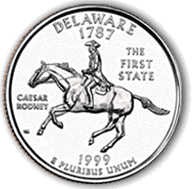</TD>
<TD>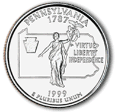</TD>
<TD>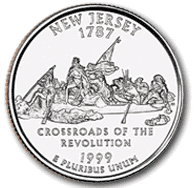</TD>
<TD>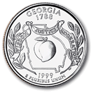</TD>
<TD>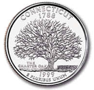</TD>
</TR>
<TR>
<TD></TD>
<TD> Delaware</TD>
<TD> Pennsylvania</TD>
<TD> New Jersey</TD>
<TD> Georgia</TD>
<TD> Connecticut</TD>
</TR>
<TR>
<TD>2000</TD>
<TD>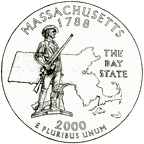</TD>
<TD></TD>
<TD>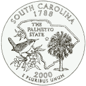</TD>
<TD>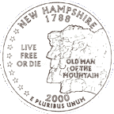</TD>
<TD>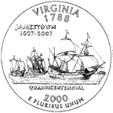</TD>
</TR>
<TR>
<TD></TD>
<TD> Masachusetts</TD>
<TD> Maryland</TD>
<TD> South carolina</TD>
<TD> New Hampshire</TD>
<TD> Virginia</TD>
</TR>
<TR>
<TD>2001</TD>
<TD>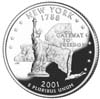</TD>
<TD></TD>
<TD>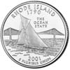</TD>
<TD>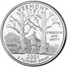</TD>
<TD>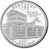</TD>
</TR>
<TR>
<TD></TD>
<TD> New York</TD>
<TD> North Carolina</TD>
<TD> Rhode Island</TD>
<TD> Vermont</TD>
<TD> Kentucky</TD>
</TR>
<TR>
<TD>2002</TD>
<TD>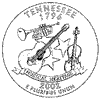</TD>
<TD>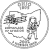</TD>
<TD>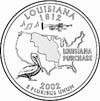</TD>
<TD>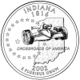</TD>
<TD>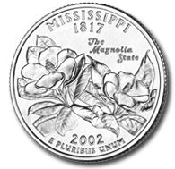</TD>
</TR>
<TR>
<TD></TD>
<TD> Tennessee</TD>
<TD> Ohio</TD>
<TD> Louisiana</TD>
<TD> Indiana</TD>
<TD> Mississippi</TD>
</TR>
<TR>
<TD>2003</TD>
<TD></TD>
<TD></TD>
<TD></TD>
<TD></TD>
<TD></TD>
</TR>
<TR>
<TD></TD>
<TD> Illinois</TD>
<TD> Alabama</TD>
<TD> Maine</TD>
<TD> Missouri</TD>
<TD> Arkansas</TD>
</TR>
<TR>
<TD>2004</TD>
<TD></TD>
<TD></TD>
<TD></TD>
<TD></TD>
<TD></TD>
</TR>
<TR>
<TD></TD>
<TD> Michigan</TD>
<TD> Florida</TD>
<TD> Texas</TD>
<TD> Iowa</TD>
<TD> Wisconsin</TD>
</TR>
<TR>
<TD>2005</TD>
<TD></TD>
<TD></TD>
<TD></TD>
<TD></TD>
<TD></TD>
</TR>
<TR>
<TD></TD>
<TD> California</TD>
<TD> Minnesota</TD>
<TD> Oregon</TD>
<TD> Kansas</TD>
<TD> West Virginia</TD>
</TR>

<TR>
<TD>2006</TD>
<TD></TD>
<TD></TD>
<TD></TD>
<TD></TD>
<TD></TD>
</TR>
<TR>
<TD></TD>
<TD> Nevada</TD>
<TD> Nebraska</TD>
<TD> Colorado</TD>
<TD> North Dakota</TD>
<TD> South Dakota</TD>
</TR>
<!------------------------------------------------------------------------->
<TR>
<TD>2007</TD>
<TD></TD>
<TD></TD>
<TD></TD>
<TD></TD>
<TD></TD>
</TR>
<TR>
<TD></TD>
<TD> Montana</TD>
<TD> Washington</TD>
<TD> Idaho</TD>
<TD> Wyoming</TD>
<TD> Utah</TD>
</TR>
<!------------------------------------------------------------------------->
<TR>
<TD>2008</TD>
<TD></TD>
<TD></TD>
<TD></TD>
<TD></TD>
<TD></TD>
</TR>
<TR>
<TD></TD>
<TD> Oklahoma</TD>
<TD> New Mexico</TD>
<TD> Arizona</TD>
<TD> Alaska</TD>
<TD> Hawaii</TD>
</TR>
<!------------------------------------------------------------------------->
</TABLE>